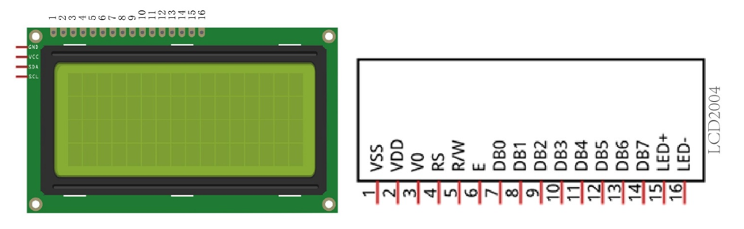
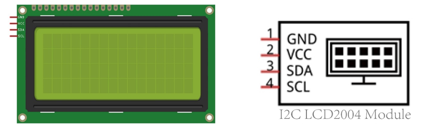

##############################################################################
Chapter 2 I2C LCD2004
##############################################################################

In the previous chapter, we studied the LCD2004 display. In order to display more content,In this chapter, we will learn about the LCD2004 Display Screen.

Project 2.1 Display the String on I2C LCD2004
***********************************************************

In this section we learn how to use LCD2004 to display something.

Component Knowledge
=======================================

I2C communication
--------------------------------------

I2C (Inter-Integrated Circuit) is a two-wire serial communication mode, which can be used for the connection of micro controllers and their peripheral equipment. Devices using I2C communication must be connected to the serial data (SDA) line, and serial clock (SCL) line (called I2C bus). Each device has a unique address and can be used as a transmitter or receiver to communicate with devices connected to the bus.

LCD2004 communication
--------------------------------------

The LCD2004 display screen can display 4 lines of characters in 20 columns. It is capable of displaying numbers, letters, symbols, ASCII code and so on. As shown below is a monochrome LCD2004 display screen along with its circuit pin diagram.

I2C LCD2004 display screen integrates a I2C interface, which connects the serial-input & parallel-output module to the LCD2004 display screen. This allows us to only use 4 lines to the operate the LCD2004.

The serial-to-parallel IC chip used in this module is PCF8574T (PCF8574AT), and its default I2C address is 0x27(0x3F). 

Below is the PCF8574 pin schematic diagram and the block pin diagram:

.. list-table:: 
    :header-rows: 1

    * - PCF8574 chip pin diagram
      - PCF8574 module pin diagram 

    * - |Chapter02_02|
      - |Chapter02_03|

PCF8574 module pin and LCD2004 pin are corresponding to each other and connected with each other:

So we only need 4 pins to control the 16 pins of the LCD2004 Display Screen through the I2C interface.

In this project, we will use the I2C LCD2004 to display some static characters and dynamic variables.

Circuit
=================================

The connection of control board and I2C LCD2004 is shown below.

.. list-table:: 
    
    * - Schematic diagram
    * - |Chapter02_05|

    * - Circuit connection
    * - |Chapter02_06|

Sketch
================================

Before writing code, we need to import the library needed. Skip this section if you have already installed it, or proceed if you haven't.

How to install the library
-----------------------------------

We use the third party library LiquidCrystal I2C. If you haven't installed it yet, please do so before learning. The steps to add third-party Libraries are as follows: open arduino->Sketch->Include library-> Manage libraries. Enter " LiquidCrystal I2C" in the search bar and select " LiquidCrystal I2C " for installation.

There is another way you can install libraries.

Click “Add .ZIP Library...” and then find **LiquidCrystal_I2C.zip** in libraries folder (this folder is in the folder unzipped form the ZIP file we provided). This library can facilitate our operation of I2C LCD2004.

Sketch_2.1_Display_the_string_on_LCD2004
--------------------------------------------------

Compile and upload the code to Arduino and the LCD2004 displays characters.

If you cannot see anything on the display or the display is not clear, try rotating the white knob on back of LCD2004 slowly, which adjusts the contrast, until the screen can display clearly.

Now let's start to write code to use LCD2004 to display static characters and dynamic variables.

.. literalinclude:: ../../../freenove_Kit/Freenove_LCD_Module_for_Arduino/Sketches/Sketch_2.1_Display_the_string_on_LCD2004/Sketch_2.1_Display_the_string_on_LCD2004.ino
    :language: c
    :linenos:
    :dedent:

Following are the LiquidCrystal_I2C library used for controlling LCD:

.. literalinclude:: ../../../freenove_Kit/Freenove_LCD_Module_for_Arduino/Sketches/Sketch_2.1_Display_the_string_on_LCD2004/Sketch_2.1_Display_the_string_on_LCD2004.ino
    :language: c
    :linenos:
    :lines: 12-12
    :dedent:

LiquidCrystal_I2C library provides LiquidCrystal_I2C class that controls LCD2004. When we instantiate a LiquidCrystal_I2C object, we can input some parameters. And these parameters are the row/column numbers of the I2C addresses and screen that connect to LCD2004:

.. literalinclude:: ../../../freenove_Kit/Freenove_LCD_Module_for_Arduino/Sketches/Sketch_2.1_Display_the_string_on_LCD2004/Sketch_2.1_Display_the_string_on_LCD2004.ino
    :language: c
    :linenos:
    :lines: 14-15
    :dedent:

And then print a string:

.. literalinclude:: ../../../freenove_Kit/Freenove_LCD_Module_for_Arduino/Sketches/Sketch_2.1_Display_the_string_on_LCD2004/Sketch_2.1_Display_the_string_on_LCD2004.ino
    :language: c
    :linenos:
    :lines: 21-21
    :dedent:

Print a changing number in the loop () function:

.. literalinclude:: ../../../freenove_Kit/Freenove_LCD_Module_for_Arduino/Sketches/Sketch_2.1_Display_the_string_on_LCD2004/Sketch_2.1_Display_the_string_on_LCD2004.ino
    :language: c
    :linenos:
    :lines: 23-28
    :dedent:

Before printing characters, we need to set the coordinate of the printed character, that is, in which line and which column:

.. literalinclude:: ../../../freenove_Kit/Freenove_LCD_Module_for_Arduino/Sketches/Sketch_2.1_Display_the_string_on_LCD2004/Sketch_2.1_Display_the_string_on_LCD2004.ino
    :language: c
    :linenos:
    :lines: 18-18
    :dedent:

.. py:function:: LiquidCrystal_I2C Class	

    LiquidCrystal_I2C class can control common LCD screen. First, we need instantiate an object of LiquidCrystal_I2C type, for example:

    **LiquidCrystal_I2C lcd(0x27, 20, 4);**

    When an object is instantiated, a constructed function of the class is called a constructor. In the constructor function, we need to fill in the I2C address of the LCD module, as well as the number of columns and rows of the LCD module. The number of columns and rows can also be set in the lcd.begin ().

    The functions used in the LiquidCrystal_I2C class are as follows:

    **lcd.setCursor (col, row):** set the coordinates of the to-be-printed character. The parameters are the numbers of columns and rows of the characters (start from 0, the number 0 represents first row or first line).

    **lcd.print (data):** print characters. Characters will be printed on the coordinates set before. If you do not set the coordinates, the string will be printed behind the last printed character.

Verify and upload the code, then observe the LCD screen. If the display is not clear or there is no display, adjust the potentiometer on the back of I2C module to adjust the screen contrast until the character is clearly displayed on the LCD.

You can use the I2C LCD2004 to replace the serial port as a mobile screen when you print the data latter.