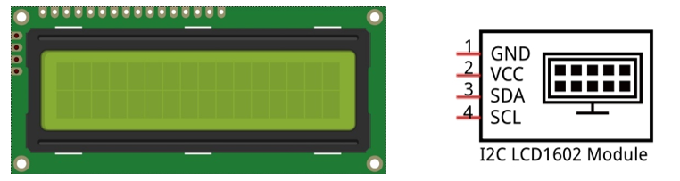
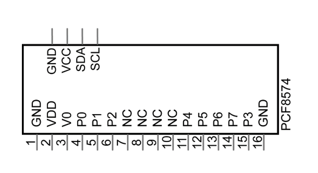

##############################################################################
Chapter 1 LCD1602
##############################################################################

In this chapter, we will learn about the LCD1602 Display Screen.

Project 1.1 Display the String on I2C LCD1602
*******************************************************

In this section we learn how to use lcd1602 to display something.

Component Knowledge
======================================

I2C communication
-------------------------------------

I2C (Inter-Integrated Circuit) is a two-wire serial communication mode, which can be used for the connection of micro controllers and their peripheral equipment. Devices using I2C communication must be connected to the serial data (SDA) line, and serial clock (SCL) line (called I2C bus). Each device has a unique address and can be used as a transmitter or receiver to communicate with devices connected to the bus.

LCD1602 communication
-------------------------------------

The LCD1602 Display Screen can display 2 lines of characters in 16 columns. It is capable of displaying numbers, letters, symbols, ASCII code and so on. As shown below is a monochrome LCD1602 Display Screen along with its circuit pin diagram.

I2C LCD1602 Display Screen integrates an I2C interface, which connects the serial-input & parallel-output module to the LCD1602 Display Screen. This allows us to use only 4 lines to the operate the LCD1602.

The serial-to-parallel IC chip used in this module is PCF8574T (PCF8574AT), and its default I2C address is 0x27(0x3F).

Below is the PCF8574 pin schematic diagram and the block pin diagram:

.. list-table:: 
    :header-rows: 1

    * - PCF8574 chip pin diagram
      - PCF8574 module pin diagram 

    * - |Chapter01_02|
      - |Chapter01_03|
  

PCF8574 module pin and LCD1602 pin are corresponding to each other and connected with each other:

So we only need 4 pins to control the 16 pins of the LCD1602 Display Screen through the I2C interface.

In this project, we will use the I2C LCD1602 to display some static characters and dynamic variables.

Circuit
======================================

.. list-table:: 

    * - Schematic diagram
    * - |Chapter01_05|

    * - Circuit connection
    * - |Chapter01_06|  

Code
===============================

Move the program folder 
--------------------------------

" **Freenove_LCD_Module/Freenove_LCD_Module_for_ESP8266/Python/Python_Codes** " to disk(D) in advance with the path of "D:/Micropython_Codes".

Open "Thonny", click "This computer" -> "D:" -> "Micropython_Codes" -> "1.1_I2C_LCD1602". Select "I2C_LCD.py"and "LCD_API.py", right click your mouse to select "Upload to /", wait for "I2C_LCD.py" and"LCD_API.py" to be uploaded to ESP8266 and then double click "I2C_LCD1602.py". 

1.1_I2C_LCD1602
-------------------------------

Click "Run current script" and LCD1602 displays some characters. 

So far, at this writing, we have two types of LCD1602 on sale. One needs to adjust the backlight, and the other does not.

The LCD1602 that does not need to adjust the backlight is shown in the figure below.

If the LCD1602 you received is the following one, and you cannot see anything on the display or the display is not clear, try rotating the white knob on back of LCD1602 slowly, which adjusts the contrast, until the screen can display clearly.

.. image:: ../../_static/imgs/ESP8266/Python/1_I2C_LCD1602/Chapter01_10.png
    :align: center

.. note::

    This is the code running online. If you disconnect USB cable and repower ESP8266 or press its reset key, LED stops blinking and the following messages will be displayed in Thonny.

Uploading code to ESP8288
-------------------------------------

As shown in the following illustration, Select "I2C_LCD.py"and"LCD_API.py"and"I2C_LCD1602.py", right click your mouse to select "Upload to /" to upload code to ESP8266.

Upload boot.py in the same way.

Press the reset key of ESP8266 and you can see LCD1602 displays some characters. 

.. note::

    Codes here is run offline. If you want to stop running offline and enter Shell, You need to use the mouse to click on the Shell,Pressing the keyboard keys "CTRL" and "C" at the same time.

:red:`If you have any concerns, please contact us via:` support@freenove.com

The following is the program code:

.. literalinclude:: ../../../../freenove_Kit/Freenove_LCD_Module_for_ESP8266/Python/Python_Codes/1.1_IIC_LCD1602/IIC_LCD1602.py
    :linenos:
    :language: python
    :dedent:

Each time a new file is opened, the program will be executed from top to bottom. When encountering a loop construction, it will execute the loop statement according to the loop condition.

Import time, I2C and I2C_LCD modules.

.. literalinclude:: ../../../../freenove_Kit/Freenove_LCD_Module_for_ESP8266/Python/Python_Codes/1.1_IIC_LCD1602/IIC_LCD1602.py
    :linenos:
    :language: python
    :lines: 1-3
    :dedent:

Instantiate the I2C LCD1602 screen. It should be noted here that if your LCD driver chip uses PCF8574T, set the I2C address to 0x27, and if uses PCF8574AT, set the I2C address to 0x3F.

.. code-block:: python
    :linenos:

    DEFAULT_I2C_ADDR = 0x27

Instantiate the I2C LCD1602 screen. It should be noted here that if your LCD driver chip uses PCF8574T, set the I2C address to 0x27, and if uses PCF8574AT, set the I2C address to 0x3F.

.. literalinclude:: ../../../../freenove_Kit/Freenove_LCD_Module_for_ESP8266/Python/Python_Codes/1.1_IIC_LCD1602/IIC_LCD1602.py
    :linenos:
    :language: python
    :lines: 5-12
    :dedent:

Initialize I2C pins and associate them with I2CLCD module, and then set the number of rows and columns for LCD1602.

.. code-block:: python
    :linenos:

    i2c = I2C(scl=Pin(14), sda=Pin(13), freq=400000)
    ...
        lcd = I2cLcd(i2c, device, 2, 16)

Move the cursor of LCD1602 to the first row, first column, and print out "Hello, world!"

.. literalinclude:: ../../../../freenove_Kit/Freenove_LCD_Module_for_ESP8266/Python/Python_Codes/1.1_IIC_LCD1602/IIC_LCD1602.py
    :linenos:
    :language: python
    :lines: 15-16
    :dedent:

The second line of LCD1602 continuously prints the number of seconds after the ESP8266 program runs.

.. literalinclude:: ../../../../freenove_Kit/Freenove_LCD_Module_for_ESP8266/Python/Python_Codes/1.1_IIC_LCD1602/IIC_LCD1602.py
    :linenos:
    :language: python
    :lines: 18-22
    :dedent:

Execute codes in a while loop.

.. code-block:: python
    :linenos:

    while True:
        ...

Put statements that may cause an error in "try" block and the executing statements when an error occurs in "except" block. In general, when the program executes statements, it will execute those in "try" block. However, when an error occurs to ESP8266 due to some interference or other reasons, it will execute statements in "except" block.

"Pass" is an empty statement. When it is executed, nothing happens. It is useful as a placeholder to make the structure of a program look better. 

.. code-block:: python
    :linenos:

    try:
        ...
    except:
        pass

MicroPython uses indentations to distinguish different blocks of code instead of braces. The number of indentations is changeable, but it must be consistent throughout one block. If the indentation of the same code block is inconsistent, it will cause errors when the program runs.

.. code-block:: python
    :linenos:

    while True:
        lcd.move_to(0, 1)
        lcd.putstr("Counter:%d" %(count))
        time.sleep_ms(1000)
        count += 1

How to import python files
---------------------------------------

Whether to import the built-in python module or to import that written by users, the command "import" is needed.

If you import the module directly you should indicate the module to which the function or attribute belongs when using the function or attribute (constant, variable) in the module. The format should be: <module name>.<function or attribute>, otherwise an error will occur.

If you only want to import a certain function or attribute in the module, use the from...import statement. The format is as follows

When using "from...import" statement to import function, to avoid conflicts and for easy understanding, you can use "as" statement to rename the imported function, as follows

Reference
-----------------------------

.. py:function:: Class I2cLcd
    
    Before each use of the object I2cLcd, please make sure that I2C_LCD.py and LCD_API.py have been uploaded to “/” of ESP32, and then add the statement “from I2C_LCD import I2cLcd” to the top of the python file. 
    
    clear(): Clear the LCD1602 screen display.
    
    show_cursor(): Show the cursor of LCD1602. 
    
    hide_cursor(): Hide the cursor of LCD1602. 
    
    blink_cursor_on(): Turn on cursor blinking.
    
    blink_cursor_off(): Turn off cursor blinking. 
    
    display_on(): Turn on the display function of LCD1602. 
    
    display_off(): Turn on the display function of LCD1602. 
    
    backlight_on(): Turn on the backlight of LCD1602.
    
    backlight_off(): Turn on the backlight of LCD1602. 
    
    move_to(cursor_x, cursor_y): Move the cursor to a specified position. 
    
    cursor_x: Column cursor_x 
    
    cursor_y: Row cursor_y 
    
    putchar(char): Print the character in the bracket on LCD1602
    
    putstr(string): Print the string in the bracket on LCD1602. 