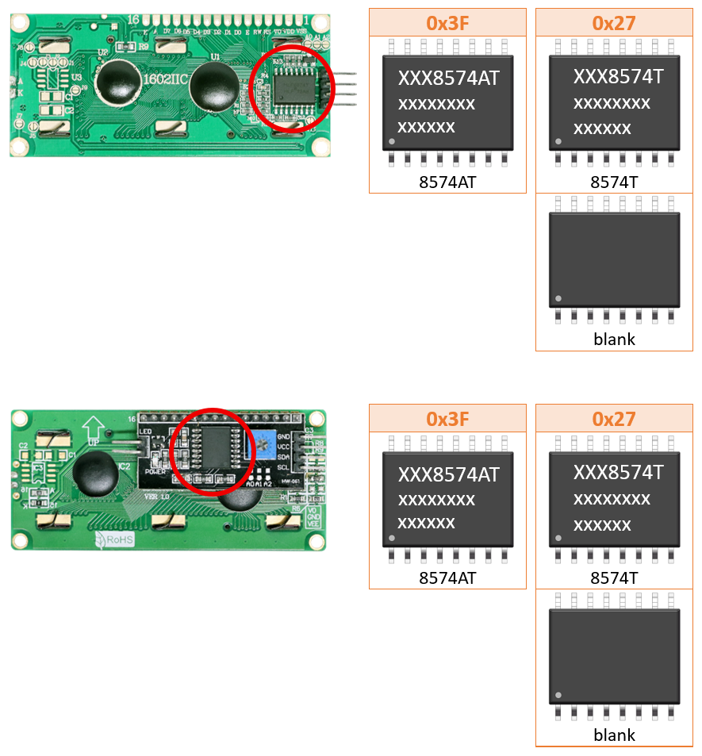
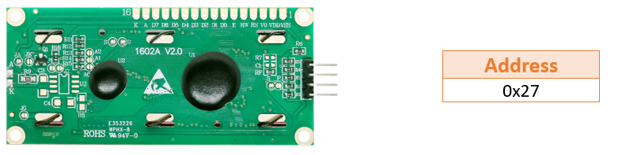
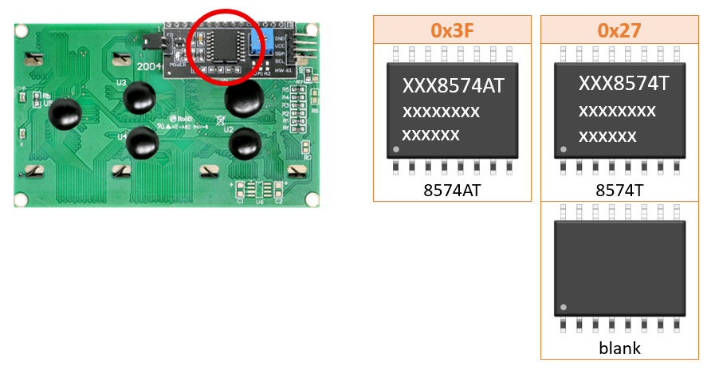

##############################################################################
About I2C Address
##############################################################################

:combo:`x-large font-bolder:For LCD1602`

:combo:`orange font-bolder xx-large:I2C Address`

Please check the chip to get the l2C address

The l2C address varies among different built-in chips.

This model of LCD1602 adopts wafer-level packaging. Although no visible chips are present on the surface, its usage method remains consistent with other models.

:combo:`x-large font-bolder:For LCD2004`

:combo:`orange font-bolder xx-large:I2C Address`

Please check the chip to get the l2C address

The l2C address varies among different built-in chips.

:combo:`x-large font-bolder:How to Change the I2C Address`

On the back of the LCD1602 and LCD2004 modules, you will find three pads labeled A0, A1, and A2. Each pad consists of two solder points. By using a soldering iron to apply a drop of solder or soldering a 0-ohm resistor across the two points, the two pads can be connected, thereby changing the device's I2C address. This requires a certain level of soldering skill.

.. image:: _static/imgs/I2C_ADDRESS/I2C_ADDRESS03.png
    :align: center