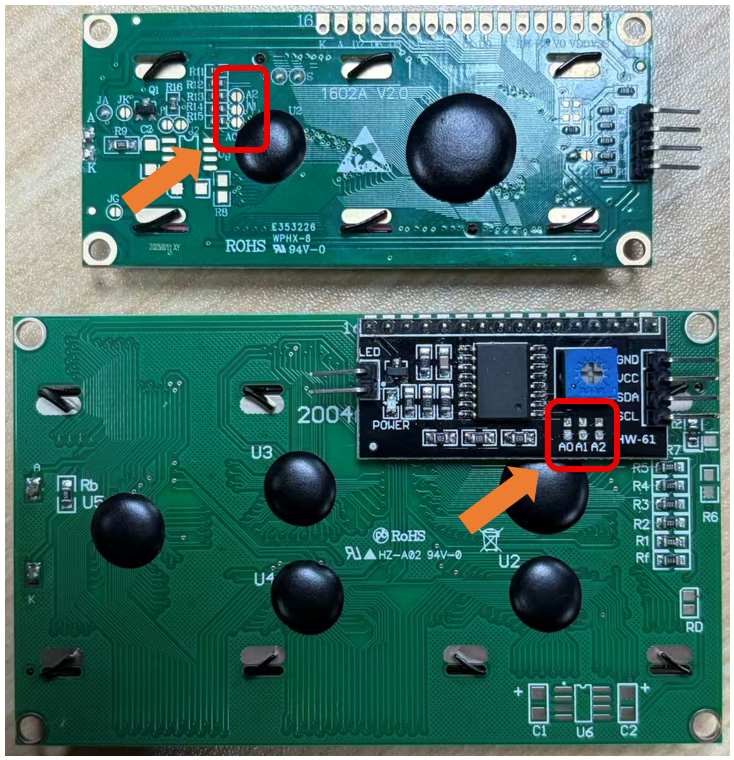

##############################################################################
How to Change the I2C Address
##############################################################################

On the back of the LCD1602 and LCD2004 modules, you will find three pads labeled A0, A1, and A2. Each pad consists of two solder points. By using a soldering iron to apply a drop of solder or soldering a 0-ohm resistor across the two points, the two pads can be connected, thereby changing the device's I2C address. This requires a certain level of soldering skill.

