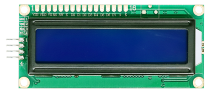
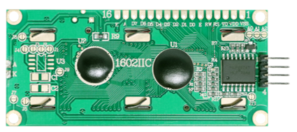
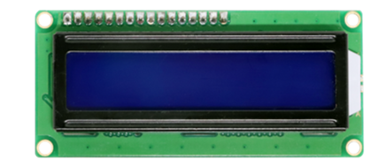
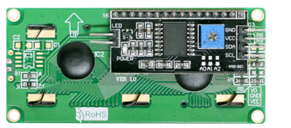
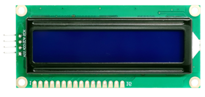
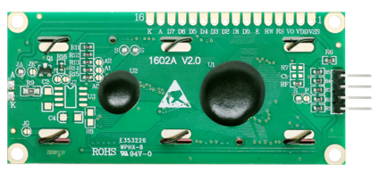
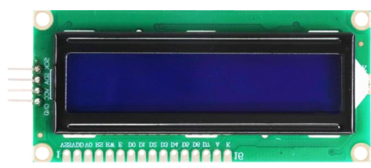
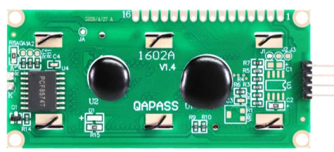

##############################################################################
Power Supply Voltage Specifications
##############################################################################

For LCD1602
**********************

**So far, at this writing, we have three types of LCD1602 on sale.**

.. table::
    :align: center
    :class: table-line

    +-----------+-----------+
    | Top       | Bottom    |
    |           |           |
    | |Power00| | |Power01| |
    +-----------+-----------+
    | Top       | Bottom    |
    |           |           |
    | |Power02| | |Power03| |
    +-----------+-----------+
    | Top       | Bottom    |
    |           |           |
    | |Power04| | |Power05| |
    +-----------+-----------+
    | Top       | Bottom    |
    |           |           |
    | |Power06| | |Power07| |
    +-----------+-----------+

