##############################################################################
Chapter 0 Preparation
##############################################################################

Why "Chapter 0"? Because in program code the first number is 0. We choose to follow this rule. In this chapter, we will do some necessary foundational preparation work: Start your Raspberry Pi and install some necessary libraries. 

Linux Command
********************************

Raspberry Pi OS is based on the Linux Operation System. Now we will introduce you to some frequently used Linux commands and rules.

First, open the Terminal. All commands are executed in Terminal. 

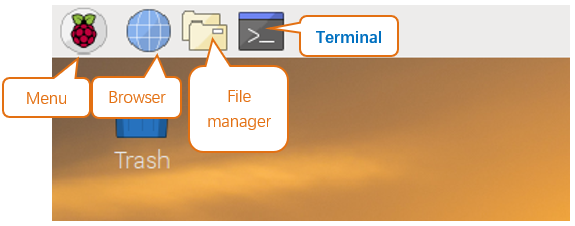

When you click the Terminal icon, following interface appears.

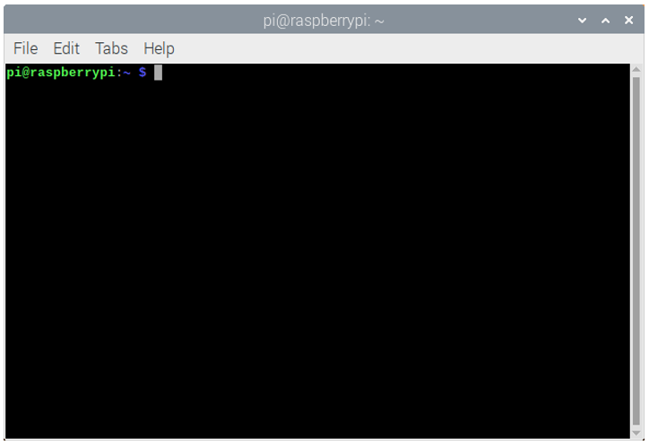

.. note::
    
    The Linux is case sensitive.

First, type “ls” into the Terminal and press the “Enter” key. The result is shown below:

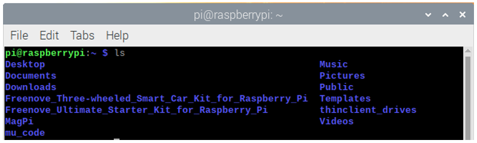

The ”ls” command lists information about the files (the current directory by default).

Content between “$” and ”pi@raspberrypi:” is the current working path. “~” represents the user directory, which refers to “/home/pi” here. 

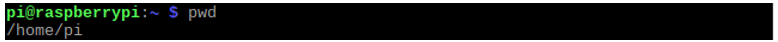

“cd” is used to change directory. “/” represents the root directory. 

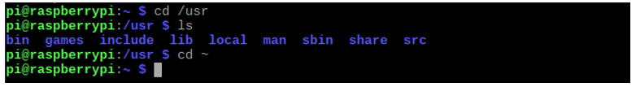

Later in this Tutorial, we will often change the working path. Typing commands under the wrong directory may cause errors and break the execution of further commands. 

Many frequently used commands and instructions can be found in the following reference table.

+---------------+-------------------------------------------------------------+
|    Command    |                         instruction                         |
+===============+=============================================================+
| ls            | Lists information about the FILEs (the current              |
|               |                                                             |
|               | directory by default) and entries alphabetically.           |
+---------------+-------------------------------------------------------------+
| cd            | Changes directory                                           |
+---------------+-------------------------------------------------------------+
| sudo + cmd    | Executes cmd under root authority                           |
+---------------+-------------------------------------------------------------+
| ./            | Under current directory                                     |
+---------------+-------------------------------------------------------------+
| gcc           | GNU Compiler Collection                                     |
+---------------+-------------------------------------------------------------+
| git clone URL | Use git tool to clone the contents of specified repository, |
|               |                                                             |
|               | and URL in the repository address.                          |
+---------------+-------------------------------------------------------------+

There are many commands, which will come later. For more details about commands. You can refer to:

http://www.linux-commands-examples.com

Shortcut Key
===============================

Now, we will introduce several commonly used shortcuts that are very useful in Terminal.

1. **Up and Down Arrow Keys:** Pressing “↑” (the Up key) will go backwards through the command history and pressing “↓” (the Down Key) will go forwards through the command history.

2. **Tab Key:** The Tab key can automatically complete the command/path you want to type. When there is only one eligible option, the command/path will be completely typed as soon as you press the Tab key even you only type one character of the command/path. 

As shown below, under the '~' directory, you enter the Documents directory with the “cd” command. After typing “cd D”, pressing the Tab key (there is no response), pressing the Tab key again then all the files/folders that begin with “D” will be listed. Continue to type the letters "oc" and then pressing the Tab key, the “Documents” is typed automatically.

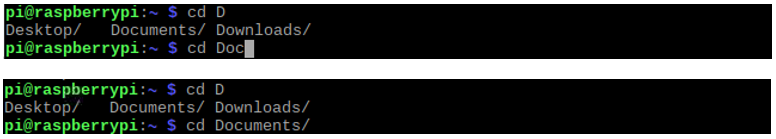

Install WiringPi
******************************

WiringPi is a GPIO access library written in C language for the used in the Raspberry Pi. 

WiringPi Installation Steps
=============================

To install the WiringPi library, please open the Terminal and then follow the steps and commands below.  

.. note::
    
    For a command containing many lines, execute them one line at a time.

Enter the following commands **one by one** in the **terminal** to install WiringPi:

.. code-block:: console
    
    sudo apt-get update
    git clone https://github.com/WiringPi/WiringPi
    cd WiringPi
    ./build

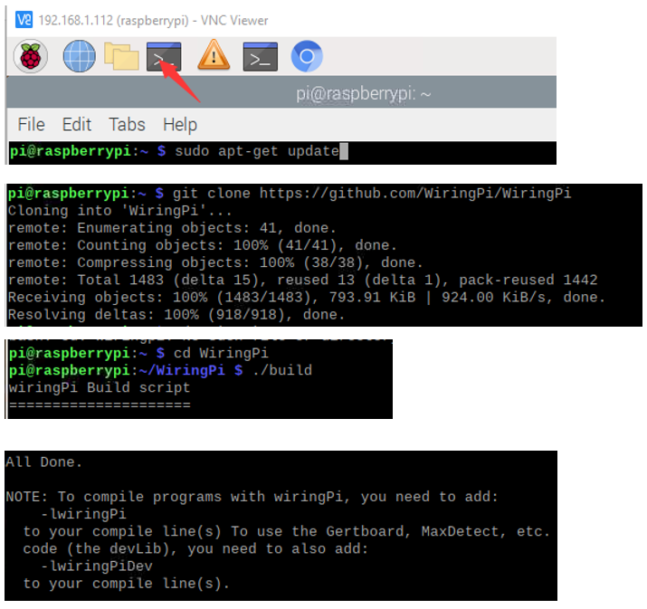

Run the gpio command to check the installation:

.. code-block:: console
    
    gpio -v

That should give you some confidence that the installation was a success.

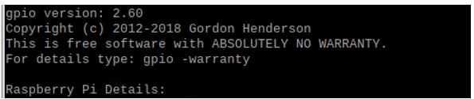

Obtain the Project Code
*******************************************

After the above installation is completed, you can visit our official website (http://www.freenove.com) or our GitHub resources at (https://github.com/freenove) to download the latest available project code. We provide both C language and Python language code for each project to allow ease of use for those who are skilled in either language. 

This is the method for obtaining the code:

In the pi directory of the RPi terminal, enter the following command.

.. code-block:: console
    
    cd
    git clone --depth 1 https://github.com/freenove/Freenove_LCD_Module

:green:`(There is no need for a password. If you get some errors, please check your commands.)`

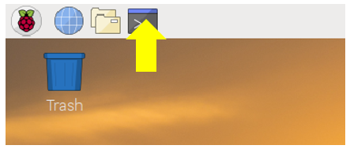

After the download is completed, a new folder " Freenove_LCD_Module" is generated, which contains all of the tutorials and required code.

:red:`This folder name seems a little too long. We can simply rename it by using the following command.`

.. code-block:: console
    
    mv Freenove_LCD_Module/ Freenove_Kit/

"Freenove_Kit" is now the new and much shorter folder name.

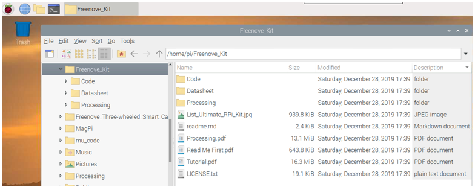

If you have no experience with Python, we suggest that you refer to this website for basic information and knowledge. 

https://python.swaroopch.com/basics.html

Python2 & Python3
****************************

If you only use C/C++, you can skip this section.
 
Python code, used in our kits, can now run on Python2 and Python3. Python3 is recommend. If you want to use Python2, please make sure your Python version is 2.7 or above. Python2 and Python3 are not fully compatible. However, Python2.6 and Python2.7 are transitional versions to python3, therefore you can also use Python2.6 and 2.7 to execute some Python3 code.

You can type “python2” or “python3” respectively into Terminal to check if python has been installed. Press Ctrl-Z to exit.

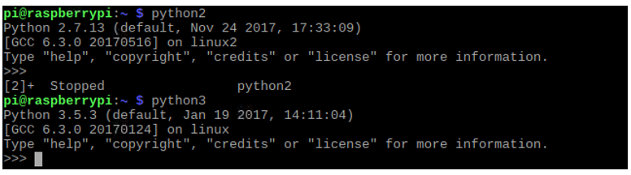

Type “python”, and Terminal shows that it links to python2.

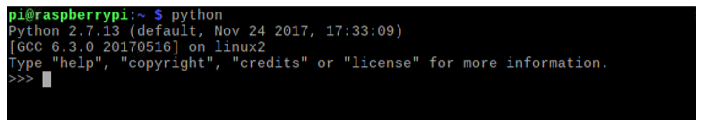

If you want to use Python3 in Raspberry Pi, it is recommended to set python3 as default Python by following the steps below.

1.	Enter directory /usr/bin 

.. code-block:: console
    
    cd /usr/bin

2.	Delete the old python link.

.. code-block:: console
    
    sudo rm python

3.	Create new python links to python3.

.. code-block:: console
    
    sudo ln -s python3 python

4.	Execute python to check whether the link succeeds.

.. code-block:: console
    
    python

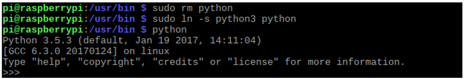

If you want to use Python2, repeat the steps above and just change the third command to the following:

.. code-block:: console
    
    sudo ln -s python2 python

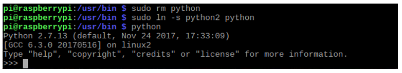

We will only use the term “Python” without reference to Python2 or Python3. You can choose to use either. 

Finally, all the necessary preparations have been completed! Next, we will combine the RPi and electronic components to build a series of projects from easy to the more challenging and difficult as we focus on learning the associated knowledge of each electronic circuit.