##############################################################################
Chapter 1 LCD1602
##############################################################################

In this chapter, we will learn about the LCD1602 Display Screen,

Project 1.1 I2C LCD1602
***********************************

In this section we learn how to use lcd1602 to display something.

Component List
====================================

+----------------------------------------------------+--------------------------------------+
| Raspberry Pi                                       | GPIO Extension Board & Ribbon Cable  |
|                                                    |                                      |
| (Recommended: Raspberry Pi 4B / 3B+ / 3B           | |Chapter01_01|                       |
|                                                    |                                      |
| Compatible: 3A+ / 2B / 1B+ / 1A+ / Zero W / Zero)  |                                      |
|                                                    |                                      |
| |Chapter01_00|                                     |                                      |
+----------------------------------------------------+--------------------------------------+
| Breadboard x1                                                                             |
|                                                                                           |
| |Chapter01_02|                                                                            |
+----------------------------------------------------+--------------------------------------+
| I2C LCD1602 Module x1                              | Jumper Wire x4                       |
|                                                    |                                      |
| |Chapter01_03|                                     | |Chapter01_04|                       |
+----------------------------------------------------+--------------------------------------+

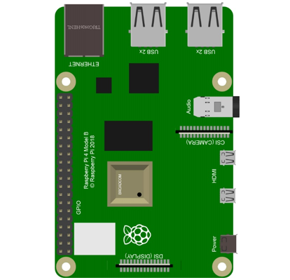
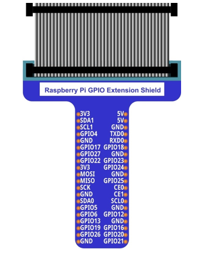
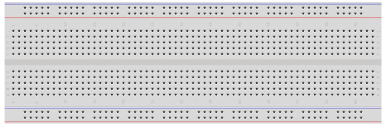
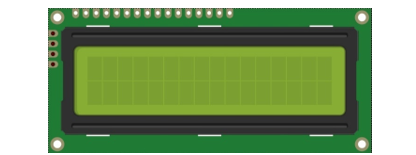
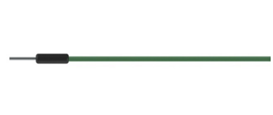

GPIO
==============================

GPIO: General Purpose Input/Output. Here we will introduce the specific function of the pins on the Raspberry Pi and how you can utilize them in all sorts of ways in your projects. Most RPi Module pins can be used as either an input or output, depending on your program and its functions.

When programming GPIO pins there are 3 different ways to reference them: GPIO Numbering, Physical Numbering and WiringPi GPIO Numbering.

BCM GPIO Numbering
------------------------------

The Raspberry Pi CPU uses Broadcom (BCM) processing chips BCM2835, BCM2836 or BCM2837. GPIO pin numbers are assigned by the processing chip manufacturer and are how the computer recognizes each pin. The pin numbers themselves do not make sense or have meaning as they are only a form of identification. Since their numeric values and physical locations have no specific order, there is no way to remember them so you will need to have a printed reference or a reference board that fits over the pins.

Each pin's functional assignment is defined in the image below:

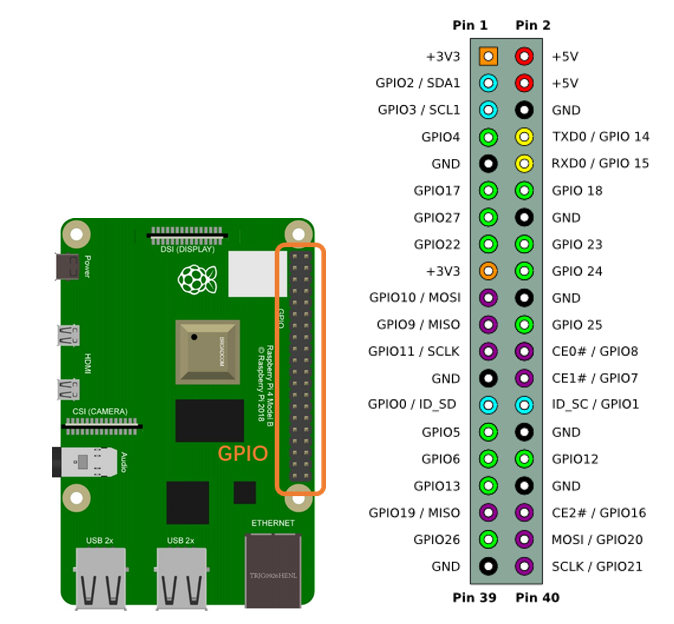

For more details about pin definition of GPIO, please refer to http://pinout.xyz/

PHYSICAL Numbering
----------------------------

Another way to refer to the pins is by simply counting across and down from pin 1 at the top left (nearest to the SD card). This is 'Physical Numbering', as shown below:

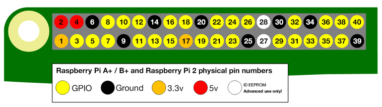

WiringPi GPIO Numbering
---------------------------

Different from the previous two types of GPIO serial numbers, RPi GPIO serial number of the WiringPi are numbered according to the BCM chip use in RPi.

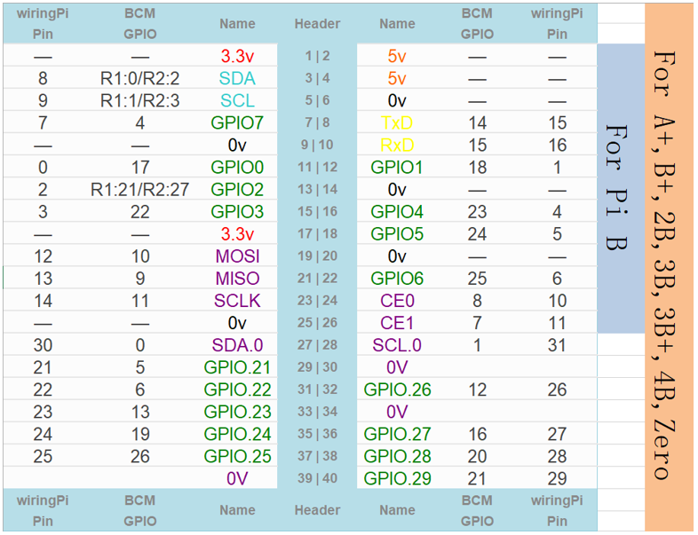

(For more details, please refer to https://projects.drogon.net/raspberry-pi/wiringpi/pins/ )

You can also use the following command to view their correlation.

.. code-block:: console
    
    gpio readall

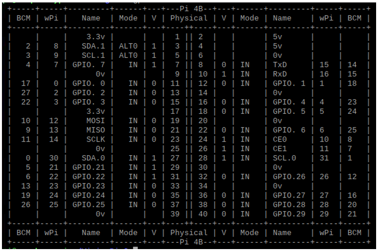

Circuit
=========================

Note that the power supply for I2C LCD1602 in this circuit is 5V.

+---------------------------------------------------------------------+
| Schematic diagram                                                   |
|                                                                     |
| |Chapter01_09|                                                      |
+---------------------------------------------------------------------+
| Hardware connection. If you need any support,                       |
|                                                                     |
| please feel free to contact us via: support@freenove.com            |
|                                                                     |
| **NOTE: It is necessary to configure 12C and install Smbus first.** |
|                                                                     |
| |Chapter01_10|                                                      |
+---------------------------------------------------------------------+

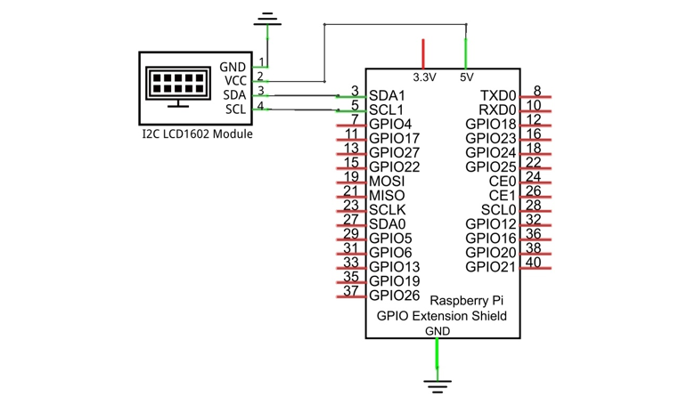
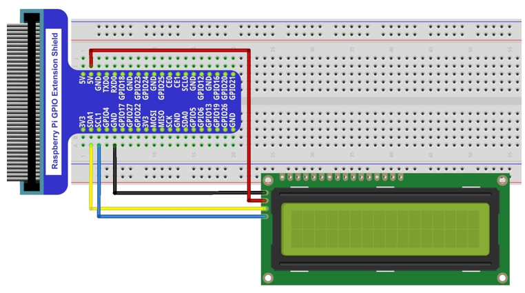

Component knowledge
=========================

Breadboard
----------------------

Here we have a small breadboard as an example of how the rows of holes (sockets) are electrically attached. The left picture shows the ways the pins have shared electrical connection and the right picture shows the actual internal metal, which connect these rows electrically.

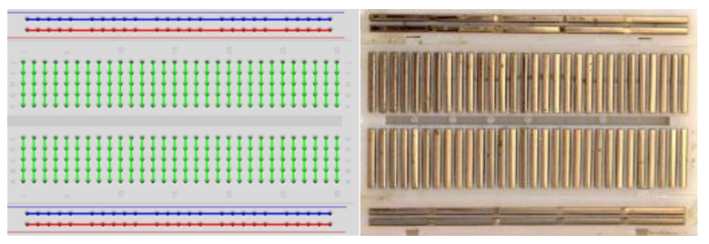

GPIO Extension Board
---------------------

GPIO board is a convenient way to connect the RPi I/O ports to the breadboard directly. The GPIO pin sequence on Extension Board is identical to the GPIO pin sequence of RPi. 

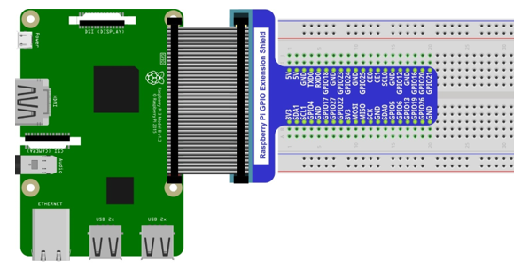

I2C communication
------------------------------

I2C (Inter-Integrated Circuit) has a two-wire serial communication mode, which can be used to connect a micro-controller and its peripheral equipment. Devices using I2C communications must be connected to the serial data line (SDA), and serial clock line (SCL) (called I2C bus). Each device has a unique address which can be used as a transmitter or receiver to communicate with devices connected via the bus.

LCD1602 communication
------------------------------

There are LCD1602 display screen and the I2C LCD. We will introduce both of them in this chapter. But what we use in this project is an I2C LCD1602 display screen. The LCD1602 Display Screen can display 2 lines of characters in 16 columns. It is capable of displaying numbers, letters, symbols, ASCII code and so on. As shown below is a monochrome LCD1602 Display Screen along with its circuit pin diagram

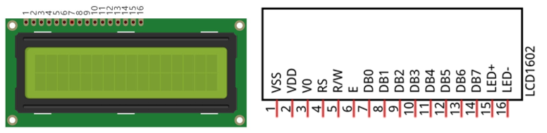

I2C LCD1602 Display Screen integrates a I2C interface, which connects the serial-input & parallel-output module to the LCD1602 Display Screen. This allows us to only use 4 lines to operate the LCD1602.

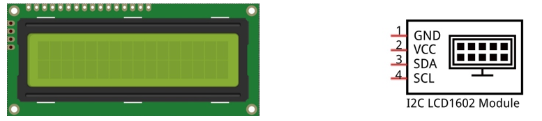

The serial-to-parallel IC chip used in this module is PCF8574T (PCF8574AT), and its default I2C address is 0x27(0x3F). You can also view the RPI bus on your I2C device address through command "i2cdetect -y 1" (refer to the "configuration I2C" section below). 

Below is the PCF8574 chip pin diagram and its module pin diagram:

+--------------------------+----------------------------+
| PCF8574 chip pin diagram | PCF8574 module pin diagram |
|                          |                            |
| |Chapter01_15|           | |Chapter01_16|             |
+--------------------------+----------------------------+

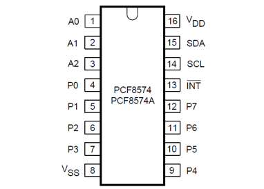
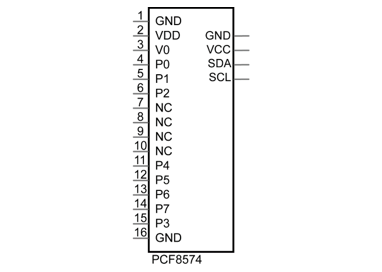

PCF8574 module pins and LCD1602 pins correspond to each other and connected to each other:

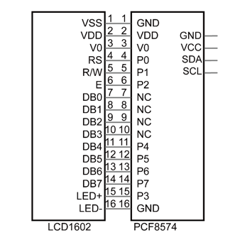

Because of this, as stated earlier, we only need 4 pins to control the16 pins of the LCD1602 Display Screen through the I2C interface.

In this project, we will use the I2C LCD1602 to display some static characters and dynamic variables.

Configure I2C and Install Smbus 
======================================

If you have already configured I2C and installed Smbus, skip this section. If you have not, proceed with the following configuration.

Enable I2C
--------------------------------------

The I2C interface in Raspberry Pi is disabled by default. You will need to open it manually and enable the I2C interface as follows:

Type command in the Terminal:

.. code-block:: console
    
    sudo raspi-config

Then open the following dialog box:

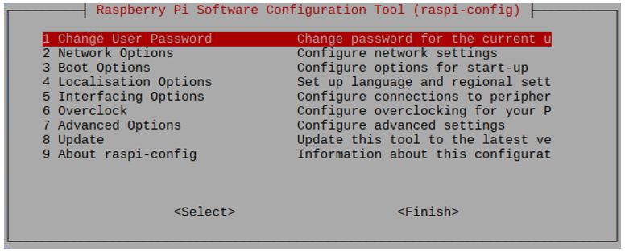

Choose “5 Interfacing Options” then “P5 I2C” then “Yes” and then “Finish” in this order and restart your RPi. The I2C module will then be started.

Type a command to check whether the I2C module is started:

.. code-block:: console
    
    lsmod | grep i2c

If the I2C module has been started, the following content will be shown. “bcm2708" refers to the CPU model. Different models of Raspberry Pi display different contents depending on the CPU installed:

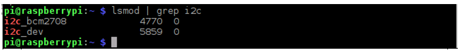

Install I2C-Tools
-------------------------------------

Next, type the command to install I2C-Tools. It is available with the Raspberry Pi OS by default.

.. code-block:: console
    
    sudo apt-get install i2c-tools

I2C device address detection:

.. code-block:: console
    
    i2cdetect -y 1

When you use the serial-parallel IC chip PCF8574T, its I2C default address is 0x27. When the serial-parallel IC chip you use is PCF8574AT, its I2C default address is 0x3F.

When you use the serial-parallel IC chip PCF8574T, the result should look like this:

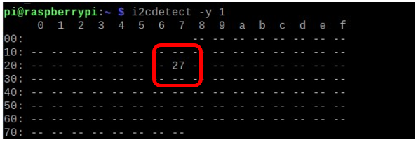

Here, 27 (HEX) is the I2C address of LCD2004 Module (PCF8574T).
When you are using PCF8574AT, and its default I2C address is 0x3F.

Install Smbus Module

.. code-block:: console
    
    sudo apt-get install python-smbus
    sudo apt-get install python3-smbus

Code
============================

This code will have your RPi's CPU temperature and System Time Displayed on the LCD1602.

C Code 1.1 I2CLCD1602
-----------------------------

If you did not configure I2C and install Smbus, please complete the configuration and installation. If you did, please continue.

First, observe the project result, and then learn about the code in detail.

:red:`If you have any concerns, please contact us via:` support@freenove.com

1.	Use cd command to enter 1.1_I2CLCD1602 directory of C code.

.. code-block:: console
    
    cd ~/Freenove_Kit/Freenove_LCD_Module_for_Raspberry_Pi/Code/C_Code/1.1_I2CLCD1602

2.	Use following command to compile “I2CLCD1602.c” and generate executable file “I2CLCD1602”.

.. code-block:: console
    
    gcc I2CLCD1602.c -o I2CLCD1602 -lwiringPi -lwiringPiDev

3.	Then run the generated file “I2CLCD1602”.

.. code-block:: console
    
    sudo ./I2CLCD1602

After the program is executed, the LCD1602 Screen will display your RPi's CPU Temperature and System Time.

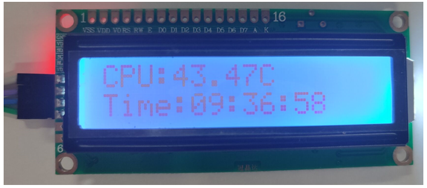

.. note::
    
    After the program is executed, if you cannot see anything on the display or the display is not clear, try rotating the white knob on back of LCD1602 slowly, which adjusts the contrast, until the screen can display the Time and Temperature clearly.

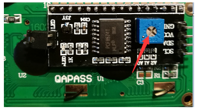

The following is the program code:

.. literalinclude:: ../../../freenove_Kit/Freenove_LCD_Module_for_Raspberry_Pi/C/C_Code/1.1_I2CLCD1602/I2CLCD1602.c
    :linenos:
    :language:  c
    :dedent:

First, define the I2C address of the PCF8574 and the Extension of the GPIO pin, which is connected to the GPIO pin of the LCD1602. LCD1602 has two different i2c addresses. Set 0x27 as default.

.. literalinclude:: ../../../freenove_Kit/Freenove_LCD_Module_for_Raspberry_Pi/C/C_Code/1.1_I2CLCD1602/I2CLCD1602.c
    :linenos:
    :language:  c
    :lines: 15-25
    :dedent:

Then, in main function, initialize the PCF8574, set all the pins to output mode, and turn ON the LCD1602 backlight (without the backlight the Display is difficult to read). 

.. literalinclude:: ../../../freenove_Kit/Freenove_LCD_Module_for_Raspberry_Pi/C/C_Code/1.1_I2CLCD1602/I2CLCD1602.c
    :linenos:
    :language:  c
    :lines: 81-85
    :dedent:

Then use lcdInit() to initialize LCD1602 and set the RW pin of LCD1602 to 0 (can be written) according to requirements of this function. The return value of the function called "Handle" is used to handle LCD1602 ".

.. literalinclude:: ../../../freenove_Kit/Freenove_LCD_Module_for_Raspberry_Pi/C/C_Code/1.1_I2CLCD1602/I2CLCD1602.c
    :linenos:
    :language:  c
    :lines: 87-87
    :dedent:

Details about lcdInit():

.. py:function:: int lcdInit (int rows, int cols, int bits, int rs, int strb, int d0, int d1, int d2, int d3, int d4, int d5, int d6, int d7) ;	

    This is the main initialization function and must be executd first before you use any other LCD functions. Rows and cols are the rows and columns of the Display (e.g. 2, 16 or 4, 20). Bits is the number of how wide the number of bits is on the interface (4 or 8). The rs and strb represent the pin numbers of the Display’s RS pin and Strobe (E) pin. The parameters d0 through d7 are the pin numbers of the 8 data pins connected from the RPi to the display. Only the first 4 are used if you are running the display in 4-bit mode.

    The return value is the 'handle' to be used for all subsequent calls to the lcd library when dealing with that LCD, or -1 to indicate a fault (usually incorrect parameter)

    For more details about LCD Library, please refer to: https://projects.drogon.net/raspberry-pi/wiringpi/lcd-library/ 

In the next “while”, two subfunctions are called to display the RPi's CPU Temperature and the SystemTime. First look at subfunction printCPUTemperature(). The CPU temperature data is stored in the :orange:`"/sys/class/thermal/thermal_zone0/temp"` file. We need to read the contents of this file, which converts it to temperature value stored in variable CPU_temp and uses lcdPrintf() to display it on LCD.

.. literalinclude:: ../../../freenove_Kit/Freenove_LCD_Module_for_Raspberry_Pi/C/C_Code/1.1_I2CLCD1602/I2CLCD1602.c
    :linenos:
    :language:  c
    :lines: 28-40
    :dedent:

Details about lcdPosition() and lcdPrintf():

.. py:function:: lcdPosition (int handle, int x, int y);	

    Set the position of the cursor for subsequent text entry.

.. py:function:: lcdPutchar (int handle, uint8_t data)
                 lcdPuts (int handle, char \*string)
                 lcdPrintf (int handle, char *message, …)	

    These output a single ASCII character, a string or a formatted string using the usual print formatting commands to display individual characters (it is how you are able to see characters on your computer monitor).

Next is subfunction printDataTime() used to display System Time. First, it gets the Standard Time and stores it into variable Rawtime, and then converts it to the Local Time and stores it into timeinfo, and finally displays the Time information on the LCD1602 Display.

.. literalinclude:: ../../../freenove_Kit/Freenove_LCD_Module_for_Raspberry_Pi/C/C_Code/1.1_I2CLCD1602/I2CLCD1602.c
    :linenos:
    :language:  c
    :lines: 41-49
    :dedent:

Python Code 1.1 I2CLCD1602
--------------------------------------

If you did not configure I2C and install Smbus, please complete the configuration and installation. If you did, please continue.

First, observe the project result, and then learn about the code in detail.

:red:`If you have any concerns, please contact us via:` support@freenove.com

1.	Use cd command to enter 1.1_I2CLCD1602 directory of Python code.

.. code-block:: console
    
    cd ~/Freenove_Kit/Freenove_LCD_Module_for_Raspberry_Pi/Code/Python_Code/1.1_I2CLCD1602

2.	Use Python command to execute Python code “I2CLCD1602.py”.

.. code-block:: console
    
    python I2CLCD1602.py

After the program is executed, the LCD1602 Screen will display your RPi's CPU Temperature and System Time. 

.. note:: 
    
    After the program is executed, if you cannot see anything on the display or the display is not clear, try rotating the white knob on back of LCD1602 slowly, which adjusts the contrast, until the screen can display the Time and Temperature clearly.

The following is the program code:

.. literalinclude:: ../../../freenove_Kit/Freenove_LCD_Module_for_Raspberry_Pi/Python/Python_Code/1.1_I2CLCD1602/I2CLCD1602.py
    :linenos:
    :language:  python
    :dedent:

Two modules are used in the code, PCF8574.py and Adafruit_LCD1602.py. These two documents and the code files are stored in the same directory, and neither of them is dispensable. Please DO NOT DELETE THEM! PCF8574.py is used to provide I2C communication mode and operation method of some of the ports for the RPi and PCF8574 IC Chip. Adafruit module Adafruit_LCD1602.py is used to provide some functional operation method for the LCD1602 Display.

In the code, first get the object used to operate the PCF8574's port, then get the object used to operate the LCD1602.

.. literalinclude:: ../../../freenove_Kit/Freenove_LCD_Module_for_Raspberry_Pi/Python/Python_Code/1.1_I2CLCD1602/I2CLCD1602.py
    :linenos:
    :language:  python
    :lines: 36-48
    :dedent:

According to the circuit connection, port 3 of PCF8574 is connected to the positive pole of the LCD1602 Display’s backlight. Then in the loop () function, use of mcp.output (3,1) to turn the LCD1602 Display's backlight ON and then set the number of LCD lines and columns.

.. literalinclude:: ../../../freenove_Kit/Freenove_LCD_Module_for_Raspberry_Pi/Python/Python_Code/1.1_I2CLCD1602/I2CLCD1602.py
    :linenos:
    :language:  python
    :lines: 23-25
    :dedent:

In the next while loop, set the cursor position, and display the CPU temperature and time.

.. literalinclude:: ../../../freenove_Kit/Freenove_LCD_Module_for_Raspberry_Pi/Python/Python_Code/1.1_I2CLCD1602/I2CLCD1602.py
    :linenos:
    :language:  python
    :lines: 26-31
    :dedent:

CPU temperature is stored in file “/sys/class/thermal/thermal_zone0/temp”. Open the file and read content of the file, and then convert it to Celsius degrees and return. Subfunction used to get CPU temperature is shown below:

.. literalinclude:: ../../../freenove_Kit/Freenove_LCD_Module_for_Raspberry_Pi/Python/Python_Code/1.1_I2CLCD1602/I2CLCD1602.py
    :linenos:
    :language:  python
    :lines: 14-18
    :dedent:

Subfunction used to get time:

.. literalinclude:: ../../../freenove_Kit/Freenove_LCD_Module_for_Raspberry_Pi/Python/Python_Code/1.1_I2CLCD1602/I2CLCD1602.py
    :linenos:
    :language:  python
    :lines: 20-21
    :dedent:

Details about PCF8574.py and Adafruit_LCD1602.py:

.. py:function:: Module PCF8574	

    This module provides two classes **PCF8574_I2C** and **PCF8574_GPIO**.

    Class **PCF8574_I2C**: provides reading and writing method for PCF8574.

    Class **PCF8574_GPIO**: provides a standardized set of GPIO functions.

    More information can be viewed through opening PCF8574.py.

    Adafruit_LCD1602 Module

.. py:function:: Module Adafruit_LCD1602	

    This module provides the basic operation method of LCD1602, including class Adafruit_CharLCD. Some member functions are described as follows:

    **def begin(self, cols, lines):** set the number of lines and columns of the screen.

    **def clear(self):** clear the screen

    **def setCursor(self, col, row):** set the cursor position

    **def message(self, text):** display contents

    More information can be viewed through opening Adafruit_CharLCD.py.