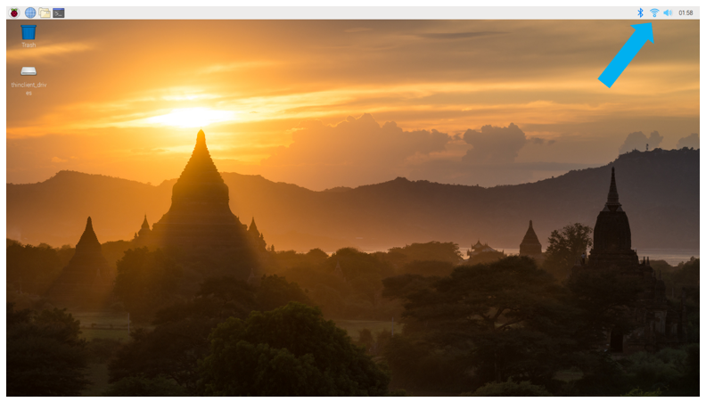

##############################################################################
Installing an Operating System
##############################################################################

The first step is to install an operating system on your RPi so that it can be programmed and function. If you have installed a system in your RPi, you can start from Chapter 0 Preparation.

Component List 
**********************************

Required Components
=================================

+-------------------------------+--------------------------------------------------+
| Any Raspberry Pi with 40 GPIO | 5V/3A Power Adapter. Note: Different versions of |
|                               |                                                  |
| |Install00|                   | Raspberry Pi have different power requirements   |
|                               |                                                  |
|                               | (please check the power requirements for yours   |
|                               |                                                  |
|                               | on the chart in the following page.)             |
|                               |                                                  |
|                               | |Install01|                                      |
+-------------------------------+--------------------------------------------------+
| Micro or Type-C USB Cable x1  | Micro SD Card (TF Card) x1, Card Reader x1       |
|                               |                                                  |
| |Install02|                   | |Install03|                                      |
+-------------------------------+--------------------------------------------------+

Power requirements of various versions of Raspberry Pi are shown in following table:

+-------------------------+-------------+-----------------------------+--------------------+
|Product                  |Recommended  |Maximum total USB            |Typical bare-board  |
|                         |             |                             |                    |
|                         |PSU current  |peripheral current draw      |active current      |
|                         |             |                             |                    |
|                         |capacity     |                             |consumption         |
+=========================+=============+=============================+====================+
| Raspberry Pi Model A    | 700mA       | 500mA                       | 200mA              |
+-------------------------+-------------+-----------------------------+--------------------+
| Raspberry Pi Model B    | 1.2A        | 500mA                       | 500mA              |
+-------------------------+-------------+-----------------------------+--------------------+
| Raspberry Pi Model A+   | 700mA       | 500mA                       | 180mA              |
+-------------------------+-------------+-----------------------------+--------------------+
| Raspberry Pi Model B+   | 1.8A        | 600mA/1.2A (switchable)     | 330mA              |
+-------------------------+-------------+-----------------------------+--------------------+
| Raspberry Pi 2 Model B  | 1.8A        | 600mA/1.2A (switchable)     | 350mA              |
+-------------------------+-------------+-----------------------------+--------------------+
| Raspberry Pi 3 Model B  | 2.5A        | 1.2A                        | 400mA              |
+-------------------------+-------------+-----------------------------+--------------------+
| Raspberry Pi 3 Model A+ | 2.5A        | Limited by PSU, board,      | 350mA              |
|                         |             |                             |                    |
|                         |             | and connector ratings only. |                    |
+-------------------------+-------------+-----------------------------+--------------------+
| Raspberry Pi 3 Model B+ | 2.5A        | 1.2A                        | 500mA              |
+-------------------------+-------------+-----------------------------+--------------------+
| Raspberry Pi 4 Model B  | 3.0A        | 1.2A                        | 600mA              |
+-------------------------+-------------+-----------------------------+--------------------+
| Raspberry Pi Zero W     | 1.2A        | Limited by PSU, board,      | 150mA              |
|                         |             |                             |                    |
|                         |             | and connector ratings only. |                    |
+-------------------------+-------------+-----------------------------+--------------------+
| Raspberry Pi Zero       | 1.2A        | Limited by PSU, board,      | 100mA              |
|                         |             |                             |                    |
|                         |             | and connector ratings only  |                    |
+-------------------------+-------------+-----------------------------+--------------------+

For more details, please refer to https://www.raspberrypi.org/help/faqs/#powerReqs

In addition, RPi also needs an Ethernet network cable used to connect it to a WAN (Wide Area Network).

All these components are necessary for any of your projects to work. Among them, the power supply of at least 5V/2.5A, because a lack of a sufficient power supply may lead to many functional issues and even damage your RPi, we STRONGLY RECOMMEND a 5V/2.5A power supply. We also recommend using a SD Micro Card with a capacity of 16GB or more (which, functions as the RPI’s “hard drive”) and is used to store the operating system and necessary operational files.

Optional Components
**************************************

Under normal circumstances, there are two ways to login to Raspberry Pi: 1) Using a stand-alone monitor. 2) Using a remote desktop or laptop computer monitor “sharing” the PC monitor with your RPi.

Required Accessories for Monitor

If you choose to use an independent monitor, mouse and keyboard, you also need the following accessories:

1. A display with a HDMI interface

2. A Mouse and a Keyboard with an USB interface

As to Pi Zero and Pi Zero W, you also need the following accessories:

1.	A Mini-HDMI to HDMI Adapter and Cable.

2.	A Micro-USB to USB-A Adapter and Cable (Micro USB OTG Cable). 

3.	A USB HUB.

4.	USB to Ethernet Interface or USB Wi-Fi receiver. 

For different Raspberry Pi Modules, the optional items may vary slightly but they all aim to convert the interfaces to Raspberry Pi standards.

+--------------------+-----------+-----------+-----------+--------+-------------+------------+------------+
|                    | Pi Zero   | Pi A+     | Pi Zero W | Pi 3A+ | Pi B+/2B    | Pi         | Pi 4B      |
|                    |           |           |           |        |             |            |            |
|                    |           |           |           |        |             | 3B/3B+     |            |
+--------------------+-----------+-----------+-----------+--------+-------------+------------+------------+
| Monitor            | Yes (All)                                                                          |
+--------------------+-----------+-----------+-----------+--------+-------------+------------+------------+
| Mouse              | Yes (All)                                                                          |
+--------------------+-----------+-----------+-----------+--------+-------------+------------+------------+
| Keyboard           | Yes (All)                                                                          |
+--------------------+-----------+-----------+-----------+--------+-------------+------------+------------+
| Micro-HDMI to HDMI | Yes       | No        | Yes       | No     | No          | No         | No         |
|                    |           |           |           |        |             |            |            |
| Adapter & Cable    |           |           |           |        |             |            |            |
+--------------------+-----------+-----------+-----------+--------+-------------+------------+------------+
| Micro-HDMI to HDMI | No                                                                    | Yes        |
|                    |                                                                       |            |
| Adapter & Cable    |                                                                       |            |
+--------------------+-----------+-----------+-----------+--------+-------------+------------+------------+
| Micro-USB to USB-A | Yes       | No        | Yes       | No                                             |
|                    |           |           |           |                                                |
| Adapter & Cable    |           |           |           |                                                |
|                    |           |           |           |                                                |
| (Micro USB OTG     |           |           |           |                                                |
|                    |           |           |           |                                                |
| Cable)             |           |           |           |                                                |
+--------------------+-----------+-----------+-----------+--------+-------------+------------+------------+
| USB HUB            | Yes       | Yes       | Yes       | Yes    | No          | No         |            |
+--------------------+-----------+-----------+-----------+--------+-------------+------------+------------+
| USB to Ethernet    | select one from       | optional           | Internal    | Internal Integration    |
|                    |                       |                    |             |                         |
| Interface          | two or select two     |                    | Integration |                         |
|                    |                       |                    |             |                         |
|                    | from two              |                    |             |                         |
+--------------------+-----------+-----------+-----------+--------+-------------+                         +
| USB Wi-Fi Receiver |                       | Internal           | optional    |                         |
|                    |                       |                    |             |                         |
|                    |                       | Integration        |             |                         |
+--------------------+-----------+-----------+-----------+--------+-------------+------------+------------+

Required Accessories for Remote Desktop
==================================================

If you do not have an independent monitor, or if you want to use a remote desktop, you first need to login to Raspberry Pi through SSH, and then open the VNC or RDP service. This requires the following accessories.

+-----------------------+---------+-----------+-------+--------+----------+--------------+
|                       | Pi Zero | Pi Zero W | Pi A+ | Pi 3A+ | Pi B+/2B | Pi 3B/3B+/4B |
+-----------------------+---------+-----------+-------+--------+----------+--------------+
| Micro-USB to USB-A    | Yes     | Yes       | No    | No                               |
|                       |         |           |       |                                  |
| Adapter & Cable       |         |           |       |                                  |
|                       |         |           |       |                                  |
| (Micro USB OTG Cable) |         |           |       |                                  |
+-----------------------+---------+-----------+-------+                                  +
| USB to Ethernet       | Yes     | Yes       | Yes   |                                  |
|                       |         |           |       |                                  |
| interface             |         |           |       |                                  |
+-----------------------+---------+-----------+-------+--------+----------+--------------+

Raspberry Pi OS
*************************************

Without Screen - Use Raspberry Pi - under Windows PC:

.. raw:: html

   <iframe height="500" width="690" src="https://www.youtube.com/embed/7vA5utwzY0E" frameborder="0" allowfullscreen></iframe>

With Screen - Use Raspberry Pi - under Windows PC: https://youtu.be/HEywFsFrj3I

.. raw:: html

   <iframe height="500" width="690" src="https://www.youtube.com/embed/HEywFsFrj3I" frameborder="0" allowfullscreen></iframe>

Automatically Method
=====================================

You can follow the official method to install the system for raspberry pi via visiting link below:

https://projects.raspberrypi.org/en/projects/raspberry-pi-setting-up/2

In this way, the system will be downloaded automatically via the application. 

Manually Method
=====================================

After installing the Imager Tool in the link above. You can also download the system manually first. 

Visit https://www.raspberrypi.org/downloads/

And then the zip file is downloaded. 

Write System to Micro SD Card 
-------------------------------------

First, put your Micro SD card into card reader and connect it to USB port of PC. 

Then open imager toll. Choose system that you just downloaded in Use custom.

Choose the SD card. Then click “WRITE”.

Enable ssh and configure WiFi
======================================

Insert SD card
======================================

Then remove SD card from card reader and insert it into Raspberry Pi.

Getting Started with Raspberry Pi
***************************************************

Monitor desktop

If you do not have a spare monitor, please skip to next section :ref:`Remote desktop & VNC <fnk0079/codes/raspberry_pi/installing_an_operating_system:remote desktop & vnc>`. If you have a spare monitor, please follow the steps in this section. 

After the system is written successfully, take out Micro SD Card and put it into the SD card slot of RPi. Then connect your RPi to the monitor through the HDMI port, attach your mouse and keyboard through the USB ports, attach a network cable to the network port and finally, connect your power supply (making sure that it meets the specifications required by your RPi Module Version. Your RPi should start (power up). Later, after setup, you will need to enter your user name and password to login. The default user name: pi; password: raspberry. After login, you should see the following screen.

Congratulations! You have successfully installed the RASPBERRY PI OS operating system on your RPi.

Raspberry Pi 4B, 3B+/3B integrates a Wi-Fi adaptor. You can use it to connect to your Wi-Fi. Then you can use the wireless remote desktop to control your RPi. This will be helpful for the following work. Raspberry Pi of other models can use wireless remote desktop through accessing an external USB wireless card.

Remote desktop & VNC
==============================================

If you have logged in Raspberry Pi via display, you can skip to VNC Viewer.

If you don't have a spare display, mouse and keyboard for your RPi, you can use a remote desktop to share a display, keyboard, and mouse with your PC. Below is how to use: 

:ref:`MAC OS remote desktop <fnk0079/codes/raspberry_pi/installing_an_operating_system:mac os remote desktop>` and :ref:`Windows OS remote desktop <fnk0079/codes/raspberry_pi/installing_an_operating_system:windows os remote desktop>`.

MAC OS Remote Desktop
----------------------------------------------

Open the terminal and type following command. If this command doesn't work, please move to next page.

.. code-block:: console
    
    ssh pi@raspberrypi.local

The password is raspberry by default, case sensitive.

You may need to type yes during the process.

You can also use the IP address to log in Pi. 

Enter router client to inquiry IP address named “raspberry pi”. For example, I have inquired to my RPi IP address, and it is “192.168.1.131".

Open the terminal and type following command.

.. code-block:: console
    
    ssh pi@192.168.1.131

When you see pi@raspberrypi:~ $, you have logged in Pi successfully. Then you can skip to next section.

Then you can skip to :ref:`VNC Viewer <fnk0079/codes/raspberry_pi/installing_an_operating_system:vnc viewer & vnc>`.

Windows OS Remote Desktop
------------------------------------------

If you are using win10, you can use follow way to login RaspberryPi without desktop.

Press Win+R. Enter cmd. Then use this command to check IP:

.. code-block:: console
    
    ping raspberrypi.local

The one befind raspberrypi.local is the IPV6 address of RaspberryPi

Use following command to login Raspberry Pi.

ssh pi@xxxxxxxxxxx(IPV6 address)

:red:`Enter yes not y if needed.`

VNC Viewer & VNC 
-----------------------------------

Enable VNC
,,,,,,,,,,,,,,,,,,,,,,,,,,,,,,,,,

Type the following command. And select Interface Options -> P3 VNC  ->  Enter -> Yes -> OK. Here Raspberry Pi may need be restarted, and choose ok. Then open VNC interface. 

.. code-block:: console
    
    sudo raspi-config

Set Resolution
,,,,,,,,,,,,,,,,,,,,,,,,,,,,,,,,,

You can also set other resolutions. If you don't know what to set, you can set it as 1280x720 first.

Then download and install VNC Viewer according to your computer system by click following link:

https://www.realvnc.com/en/connect/download/viewer/

After installation is completed, open VNC Viewer. And click File  ->  New Connection. Then the interface is shown below. 

Enter ip address of your Raspberry Pi and fill in a name. Then click OK.

Then on the VNC Viewer panel, double-click new connection you just created, 

and the following dialog box pops up.  

Enter username: pi and Password: raspberry. And click OK.

Here, you have logged in to Raspberry Pi successfully by using VNC Viewer

If there is black window, please :ref:`set another resolution <fnk0079/codes/raspberry_pi/installing_an_operating_system:set resolution>`.

In addition, your VNC Viewer window may zoom your Raspberry Pi desktop. You can change it. On your VNC View control panel, click right key. And select Properties->Options label->Scaling. Then set proper scaling. 

Here, you have logged in to Raspberry Pi successfully by using VNC Viewer and operated proper setting.

Raspberry Pi 4B/3B+/3B integrates a Wi-Fi adaptor.If you did not connect Pi to WiFi. You can connect it to wirelessly control the robot.

