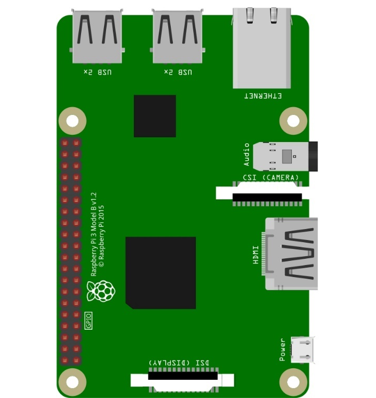
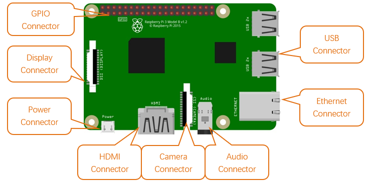
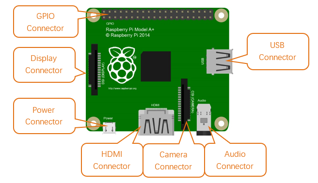

##############################################################################
Raspberry Pi
##############################################################################

So far, at this writing, Raspberry Pi has advanced to its fourth generation product offering. Version changes are accompanied by increases in upgrades in hardware and capabilities. 

The A type and B type versions of the first generation products have been discontinued due to various reasons. What is most important is that other popular and currently available versions are consistent in the order and number of pins and their assigned designation of function, making compatibility of peripheral devices greatly enhanced between versions.

Below are the raspberry pi pictures and model pictures supported by this product. They have 40 pins.

+------------------------------------------+---------------------------------------+
| Actual image of Raspberry Pi 4 Model B:  | CAD image of Raspberry Pi 4 Model B:  |
|                                          |                                       |
| |Raspberry_Pi00|                         | |Raspberry_Pi01|                      |
+------------------------------------------+---------------------------------------+
| Actual image of Raspberry Pi 3 Model B+: | CAD image of Raspberry Pi 3 Model B+: |
|                                          |                                       |
| |Raspberry_Pi02|                         | |Raspberry_Pi03|                      |
+------------------------------------------+---------------------------------------+
| Actual image of Raspberry Pi 3 Model B:  | CAD image of Raspberry Pi 3 Model B:  |
|                                          |                                       |
| |Raspberry_Pi04|                         | |Raspberry_Pi05|                      |
+------------------------------------------+---------------------------------------+
| Actual image of Raspberry Pi 2 Model B:  | CAD image of Raspberry Pi 2 Model B:  |
|                                          |                                       |
| |Raspberry_Pi06|                         | |Raspberry_Pi07|                      |
+------------------------------------------+---------------------------------------+
| Actual image of Raspberry Pi 1 Model B+: | CAD image of Raspberry Pi 1 Model B+: |
|                                          |                                       |
| |Raspberry_Pi08|                         | |Raspberry_Pi09|                      |
+------------------------------------------+---------------------------------------+
| Actual image of Raspberry Pi 3 Model A+: | CAD image of Raspberry Pi 3 Model A+: |
|                                          |                                       |
| |Raspberry_Pi10|                         | |Raspberry_Pi11|                      |
+------------------------------------------+---------------------------------------+
| Actual image of Raspberry Pi 1 Model A+: | CAD image of Raspberry Pi 1 Model A+: |
|                                          |                                       |
| |Raspberry_Pi12|                         | |Raspberry_Pi13|                      |
+------------------------------------------+---------------------------------------+
| Actual image of Raspberry Pi Zero W:     | CAD image of Raspberry Pi Zero W:     |
|                                          |                                       |
| |Raspberry_Pi14|                         | |Raspberry_Pi15|                      |
+------------------------------------------+---------------------------------------+
| Actual image of Raspberry Pi Zero:       | CAD image of Raspberry Pi Zero:       |
|                                          |                                       |
| |Raspberry_Pi16|                         | |Raspberry_Pi17|                      |
+------------------------------------------+---------------------------------------+

.. |Raspberry_Pi00| image:: ../_static/imgs/Raspberry_Pi/Raspberry_Pi/Raspberry_Pi00.png

Hardware interface diagram of RPi 4B:

Hardware interface diagram of RPi 3B+/3B/2B/1B+:

Hardware interface diagram of RPi 3A+/A+:

Hardware interface diagram of RPi Zero/Zero W:

