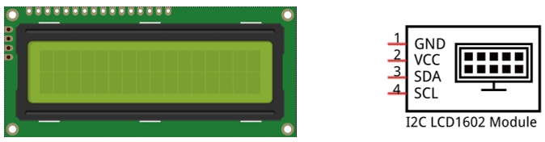
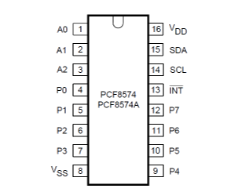
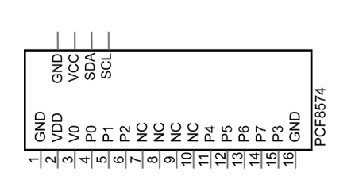
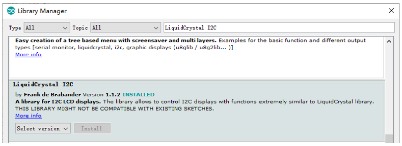
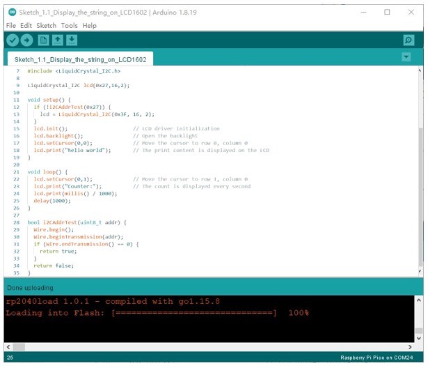
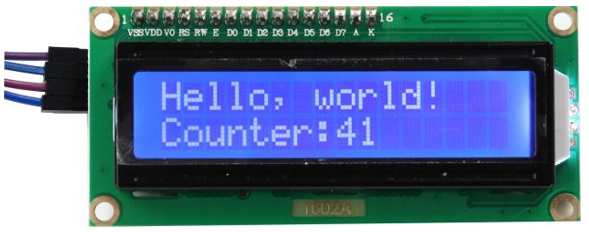
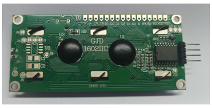
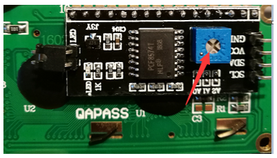

##############################################################################
Chapter 1 LCD1602
##############################################################################

In this chapter, we will learn about the LCD1602 Display Screen.

Project 1.1 LCD1602
*************************************

In this section we learn how to use LCD1602 to display something.

Component knowledge
==================================

Power
------------------------------------

Raspberry Pi Pico requires 5V power supply. You can either connect external 5V power supply to Vsys pin of

Pico or connect a USB cable to the onboard USB base to power Pico.

In this tutorial, we use USB cable to power Pico and upload sketches.

.. image:: ../../_static/imgs/Raspberry_Pi_Pico/C/1_I2C_LCD1602/Chapter01_00.png
    :align: center

I2C communication
------------------------------------

I2C (Inter-Integrated Circuit) is a two-wire serial communication mode, which can be used for the connection of micro controllers and their peripheral equipment. Devices using I2C communication must be connected to the serial data (SDA) line, and serial clock (SCL) line (called I2C bus). Each device has a unique address and can be used as a transmitter or receiver to communicate with devices connected to the bus.

LCD1602 communication
------------------------------------

The LCD1602 Display Screen can display 2 lines of characters in 16 columns. It is capable of displaying numbers, letters, symbols, ASCII code and so on. As shown below is a monochrome LCD1602 Display Screen along with its circuit pin diagram.

.. image:: ../../_static/imgs/Raspberry_Pi_Pico/C/1_I2C_LCD1602/Chapter01_01.png
    :align: center

I2C LCD1602 Display Screen integrates an I2C interface, which connects the serial-input & parallel-output module to the LCD1602 Display Screen. This allows us to use only 4 lines to the operate the LCD1602.

The serial-to-parallel IC chip used in this module is PCF8574T (PCF8574AT), and its default I2C address is 0x27(0x3F).

Below is the PCF8574 pin schematic diagram and the block pin diagram:

+--------------------------+----------------------------+
| PCF8574 chip pin diagram | PCF8574 module pin diagram |
|                          |                            |
| |Chapter01_03|           | |Chapter01_04|             |
+--------------------------+----------------------------+

PCF8574 module pin and LCD1602 pin are corresponding to each other and connected with each other:

.. image:: ../../_static/imgs/Raspberry_Pi_Pico/C/1_I2C_LCD1602/Chapter01_05.png
    :align: center

So we only need 4 pins to control the 16 pins of the LCD1602 Display Screen through the I2C interface.

In this project, we will use the I2C LCD1602 to display some static characters and dynamic variables.

Circuit
====================================

+----------------------------------------------------------+
| Schematic diagram                                        |
|                                                          |
| |Chapter01_06|                                           |
+----------------------------------------------------------+
| Hardware connection. If you need any support,            |
|                                                          |
| please feel free to contact us via: support@freenove.com |
|                                                          |
| |Chapter01_07|                                           |
+----------------------------------------------------------+

.. |Chapter01_06| image:: ../../_static/imgs/Raspberry_Pi_Pico/C/1_I2C_LCD1602/Chapter01_06.png
.. |Chapter01_07| image:: ../../_static/imgs/Raspberry_Pi_Pico/C/1_I2C_LCD1602/Chapter01_07.png

Sketch
==================================

How to install the library
---------------------------------

We use the third party library LiquidCrystal I2C. If you haven't installed it yet, please do so before learning.

The steps to add third-party Libraries are as follows: open arduino -> Sketch -> Include library -> Manage

libraries. Enter " LiquidCrystal I2C" in the search bar and select " LiquidCrystal I2C " for installation.

There is another way you can install libraries.

Click “Add .ZIP Library...” and then find LiquidCrystal_I2C.zip in libraries folder (this folder is in the folder unzipped form the ZIP file we provided). This library can facilitate our operation of I2C LCD1602.

Use I2C LCD 1602 to display characters and variables.

Sketch_1.1_Display_the_string_on_LCD1602
--------------------------------------------

Compile and upload the code to Pico and the LCD1602 displays characters.

So far, at this writing, we have two types of LCD1602 on sale. One needs to adjust the backlight, and the other does not.

The LCD1602 that does not need to adjust the backlight is shown in the figure below.

If the LCD1602 you received is the following one, and you cannot see anything on the display or the display is not clear, try rotating the white knob on back of LCD1602 slowly, which adjusts the contrast, until the screen can display clearly.

The following is the program code:

.. literalinclude:: ../../../../freenove_Kit/Freenove_LCD_Module_for_Raspberry_Pi_Pico/C/Sketches/Sketch_1.1_Display_the_string_on_LCD1602/Sketch_1.1_Display_the_string_on_LCD1602.ino
    :linenos:
    :language: C
    :dedent:

The Arduino IDE code usually contains two basic functions: void setup() and void loop(). 

After the board is reset, the setup() function will be executed firstly, and then the loop() function.

setup() function is generally used to write code to initialize the hardware. And loop() function is used to write code to achieve certain functions. loop() function is executed repeatedly. When the execution reaches the end of loop(), it will jump to the beginning of loop() to run again.

Include header file of Liquid Crystal Display (LCD)1602.

.. literalinclude:: ../../../../freenove_Kit/Freenove_LCD_Module_for_Raspberry_Pi_Pico/C/Sketches/Sketch_1.1_Display_the_string_on_LCD1602/Sketch_1.1_Display_the_string_on_LCD1602.ino
    :linenos:
    :language: C
    :lines: 7-7
    :dedent:

Instantiate the I2C LCD1602 screen. It should be noted here that if your LCD driver chip uses PCF8574T, set

the I2C address to 0x27, and if uses PCF8574AT, set the I2C address to 0x3F.

.. literalinclude:: ../../../../freenove_Kit/Freenove_LCD_Module_for_Raspberry_Pi_Pico/C/Sketches/Sketch_1.1_Display_the_string_on_LCD1602/Sketch_1.1_Display_the_string_on_LCD1602.ino
    :linenos:
    :language: C
    :lines: 13-13
    :dedent:

Initialize LCD1602 and turn on the backlight of LCD.

.. literalinclude:: ../../../../freenove_Kit/Freenove_LCD_Module_for_Raspberry_Pi_Pico/C/Sketches/Sketch_1.1_Display_the_string_on_LCD1602/Sketch_1.1_Display_the_string_on_LCD1602.ino
    :linenos:
    :language: C
    :lines: 12-16
    :dedent:

Move the cursor of LCD1602 to the first row, first column, and print out "Hello, world!"

.. literalinclude:: ../../../../freenove_Kit/Freenove_LCD_Module_for_Raspberry_Pi_Pico/C/Sketches/Sketch_1.1_Display_the_string_on_LCD1602/Sketch_1.1_Display_the_string_on_LCD1602.ino
    :linenos:
    :language: C
    :lines: 17-18
    :dedent:

Print the number on the second line of LCD1602.

.. literalinclude:: ../../../../freenove_Kit/Freenove_LCD_Module_for_Raspberry_Pi_Pico/C/Sketches/Sketch_1.1_Display_the_string_on_LCD1602/Sketch_1.1_Display_the_string_on_LCD1602.ino
    :linenos:
    :language: C
    :lines: 21-26
    :dedent:

Check whether the I2C address exists.

.. literalinclude:: ../../../../freenove_Kit/Freenove_LCD_Module_for_Raspberry_Pi_Pico/C/Sketches/Sketch_1.1_Display_the_string_on_LCD1602/Sketch_1.1_Display_the_string_on_LCD1602.ino
    :linenos:
    :language: C
    :lines: 28-35
    :dedent:

Reference
------------------------------------

.. py:function:: class LiquidCrystal 

    The LiquidCrystal class can manipulate common LCD screens. The first step is defining an object of

    LiquidCrystal, for example:

    :blue:`LiquidCrystal_I2C` lcd(0x27,16,2);

        Instantiate the Lcd1602 and set the I2C address to 0x27, with 16 columns per row and 2 rows per column.

    **init();**

        Initializes the Lcd1602's device

    **backlight();**

        Turn on Lcd1602's backlight.

    **setCursor(column,row);**

        Sets the screen's column and row.

        **column:** The range is 0 to 15.

        **row:** The range is 0 to 1.

    **print(String);**

        Print the character string on Lcd1602