##############################################################################
Chapter 2 LCD2004
##############################################################################

In the previous chapter, we studied the LCD1602 display. In order to display more content,In this chapter, we will learn about the LCD2004 Display Screen.

Project 2.1 LCD2004
*********************************

In this section we learn how to use LCD2004 to display something.

Component knowledge 
==================================

I2C communication
----------------------------------

I2C (Inter-Integrated Circuit) is a two-wire serial communication mode, which can be used for the connection of micro controllers and their peripheral equipment. Devices using I2C communication must be connected to the serial data (SDA) line, and serial clock (SCL) line (called I2C bus). Each device has a unique address and can be used as a transmitter or receiver to communicate with devices connected to the bus.

LCD2004 communication
-----------------------------------

The LCD2004 display screen can display 4 lines of characters in 20 columns. It is capable of displaying numbers, letters, symbols, ASCII code and so on. As shown below is a monochrome LCD2004 display screen along with its circuit pin diagram.

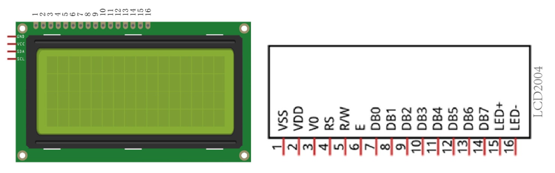

I2C LCD2004 display screen integrates a I2C interface, which connects the serial-input & parallel-output module to the LCD2004 display screen. This allows us to only use 4 lines to the operate the LCD2004.

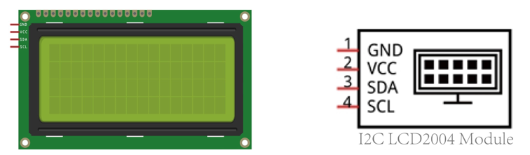

The serial-to-parallel IC chip used in this module is PCF8574T (PCF8574AT), and its default I2C address is 0x27(0x3F). 

Below is the PCF8574 pin schematic diagram and the block pin diagram:

+--------------------------+----------------------------+
| PCF8574 chip pin diagram | PCF8574 module pin diagram |
|                          |                            |
| |Chapter02_02|           | |Chapter02_03|             |
+--------------------------+----------------------------+

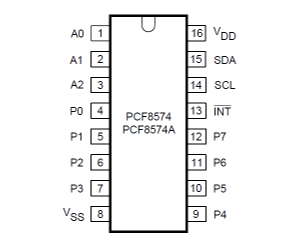
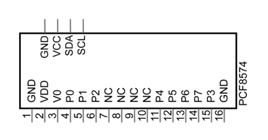

PCF8574 module pin and LCD2004 pin are corresponding to each other and connected with each other:

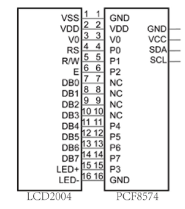

So we only need 4 pins to control the 16 pins of the LCD2004 Display Screen through the I2C interface.

In this project, we will use the I2C LCD2004 to display some static characters and dynamic variables.

Circuit
================================

+----------------------------------------------------------+
| Schematic diagram                                        |
|                                                          |
| |Chapter02_05|                                           |
+----------------------------------------------------------+
| Hardware connection. If you need any support,            |
|                                                          |
| please feel free to contact us via: support@freenove.com |
|                                                          |
| |Chapter02_06|                                           |
+----------------------------------------------------------+

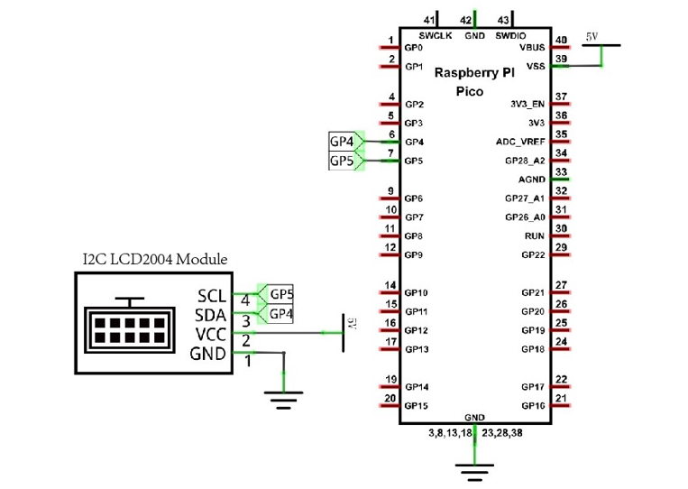
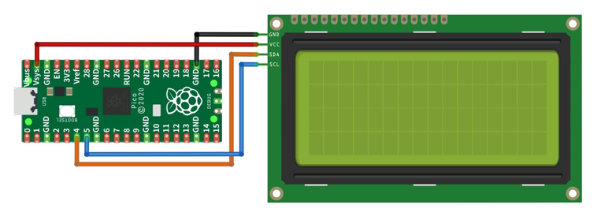

Sketch
============================

How to install the library
-------------------------------

We use the third party library LiquidCrystal I2C. If you haven't installed it yet, please do so before learning.

The steps to add third-party Libraries are as follows: open arduino -> Sketch -> Include library -> Manage

libraries. Enter " LiquidCrystal I2C" in the search bar and select " LiquidCrystal I2C " for installation.

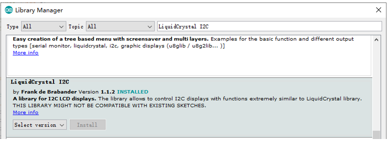

There is another way you can install libraries.

Click “Add .ZIP Library...” and then find **LiquidCrystal_I2C.zip** in libraries folder (this folder is in the folder unzipped form the ZIP file we provided). This library can facilitate our operation of I2C LCD2004.

Use I2C LCD 2004 to display characters and variables.

Sketch_2.1_Display_the_string_on_LCD2004
-------------------------------------------------

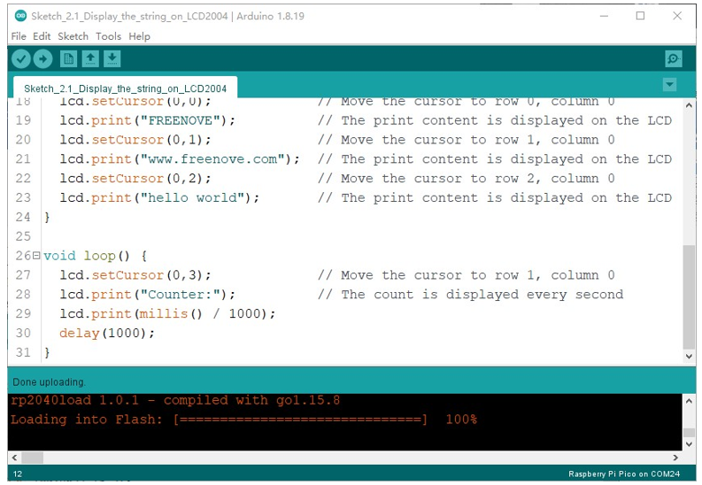

Compile and upload the code to Pico and the LCD2004 displays characters.

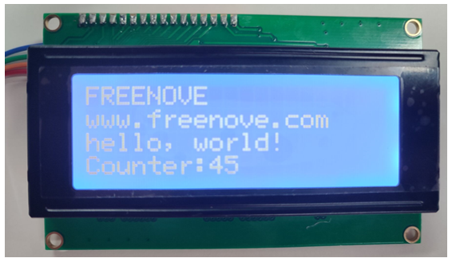

If you cannot see anything on the display or the display is not clear, try rotating the white knob on back of LCD2004 slowly, which adjusts the contrast, until the screen can display clearly.

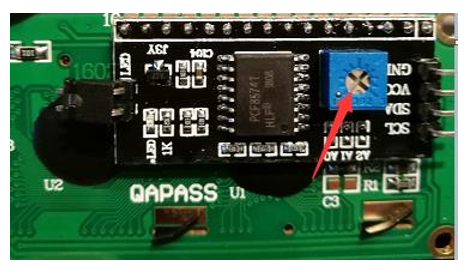

The following is the program code:

.. literalinclude:: ../../../../freenove_Kit/Freenove_LCD_Module_for_Raspberry_Pi_Pico/C/Sketches/Sketch_2.1_Display_the_string_on_LCD2004/Sketch_2.1_Display_the_string_on_LCD2004.ino
    :linenos:
    :language: c
    :dedent:

Include header file of Liquid Crystal Display (LCD)2004 and I2C.

.. literalinclude:: ../../../../freenove_Kit/Freenove_LCD_Module_for_Raspberry_Pi_Pico/C/Sketches/Sketch_2.1_Display_the_string_on_LCD2004/Sketch_2.1_Display_the_string_on_LCD2004.ino
    :linenos:
    :language: c
    :lines: 7-7
    :dedent:

Instantiate the I2C LCD2004 screen. It should be noted here that if your LCD driver chip uses PCF8574T, set the I2C address to 0x27, and if uses PCF8574AT, set the I2C address to 0x3F.

.. literalinclude:: ../../../../freenove_Kit/Freenove_LCD_Module_for_Raspberry_Pi_Pico/C/Sketches/Sketch_2.1_Display_the_string_on_LCD2004/Sketch_2.1_Display_the_string_on_LCD2004.ino
    :linenos:
    :language: c
    :lines: 12-12
    :dedent:

Initialize LCD2004 and turn on the backlight of LCD.

.. literalinclude:: ../../../../freenove_Kit/Freenove_LCD_Module_for_Raspberry_Pi_Pico/C/Sketches/Sketch_2.1_Display_the_string_on_LCD2004/Sketch_2.1_Display_the_string_on_LCD2004.ino
    :linenos:
    :language: c
    :lines: 14-15
    :dedent:

Move the cursor of LCD2004 to the third row, first column, and print out "Hello, world!"

.. literalinclude:: ../../../../freenove_Kit/Freenove_LCD_Module_for_Raspberry_Pi_Pico/C/Sketches/Sketch_2.1_Display_the_string_on_LCD2004/Sketch_2.1_Display_the_string_on_LCD2004.ino
    :linenos:
    :language: c
    :lines: 20-21
    :dedent:

Print the number on the fourth line of LCD2004.

.. literalinclude:: ../../../../freenove_Kit/Freenove_LCD_Module_for_Raspberry_Pi_Pico/C/Sketches/Sketch_2.1_Display_the_string_on_LCD2004/Sketch_2.1_Display_the_string_on_LCD2004.ino
    :linenos:
    :language: c
    :lines: 23-28
    :dedent:

Reference
--------------------------------------

.. py:function:: class LiquidCrystal 

    The LiquidCrystal class can manipulate common LCD screens. The first step is defining an object of

    LiquidCrystal, for example:

        :blue:`LiquidCrystal_I2C` **lcd(0x27,20,4);**

            Instantiate the Lcd2004 and set the I2C address to 0x27, with 20 columns per row and 4 rows per column.

        **init();**

            Initializes the Lcd2004's device

        **backlight();**

            Turn on Lcd2004's backlight.

        **setCursor(column,row);**

            Sets the screen's column and row.

            **column:** The range is 0 to 19.

            **row:** The range is 0 to 3.

        **print(String);**

            Print the character string on Lcd2004.