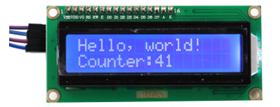

##############################################################################
Chapter 1 LCD1602
##############################################################################

In this chapter, we will learn about the LCD1602 Display Screen.

Project 1.1 LCD1602
*************************************

In this section we learn how to use LCD1602 to display something.

Component knowledge
==================================

Power
------------------------------------

Raspberry Pi Pico requires 5V power supply. You can either connect external 5V power supply to Vsys pin of

Pico or connect a USB cable to the onboard USB base to power Pico.

In this tutorial, we use USB cable to power Pico and upload sketches.

.. image:: ../../_static/imgs/Raspberry_Pi_Pico/C/1_I2C_LCD1602/Chapter01_00.png
    :align: center

I2C communication
------------------------------------

I2C (Inter-Integrated Circuit) is a two-wire serial communication mode, which can be used for the connection of micro controllers and their peripheral equipment. Devices using I2C communication must be connected to the serial data (SDA) line, and serial clock (SCL) line (called I2C bus). Each device has a unique address and can be used as a transmitter or receiver to communicate with devices connected to the bus.

LCD1602 communication
------------------------------------

The LCD1602 Display Screen can display 2 lines of characters in 16 columns. It is capable of displaying numbers, letters, symbols, ASCII code and so on. As shown below is a monochrome LCD1602 Display Screen along with its circuit pin diagram.

I2C LCD1602 Display Screen integrates an I2C interface, which connects the serial-input & parallel-output module to the LCD1602 Display Screen. This allows us to use only 4 lines to the operate the LCD1602.

.. image:: ../../_static/imgs/Raspberry_Pi_Pico/C/1_I2C_LCD1602/Chapter01_02.png
    :align: center

The serial-to-parallel IC chip used in this module is PCF8574T (PCF8574AT), and its default I2C address is 0x27(0x3F).

Below is the PCF8574 pin schematic diagram and the block pin diagram:

+--------------------------+----------------------------+
| PCF8574 chip pin diagram | PCF8574 module pin diagram |
|                          |                            |
| |Chapter01_03|           | |Chapter01_04|             |
+--------------------------+----------------------------+

.. |Chapter01_03| image:: ../../_static/imgs/Raspberry_Pi_Pico/C/1_I2C_LCD1602/Chapter01_03.png
.. |Chapter01_04| image:: ../../_static/imgs/Raspberry_Pi_Pico/C/1_I2C_LCD1602/Chapter01_04.png

PCF8574 module pin and LCD1602 pin are corresponding to each other and connected with each other:

So we only need 4 pins to control the 16 pins of the LCD1602 Display Screen through the I2C interface.

In this project, we will use the I2C LCD1602 to display some static characters and dynamic variables.

Circuit
====================================

+----------------------------------------------------------+
| Schematic diagram                                        |
|                                                          |
| |Chapter01_06|                                           |
+----------------------------------------------------------+
| Hardware connection. If you need any support,            |
|                                                          |
| please feel free to contact us via: support@freenove.com |
|                                                          |
| |Chapter01_07|                                           |
+----------------------------------------------------------+

Code
===============================

Codes used in this tutorial are saved in 

**"Freenove_LCD_Module/Freenove_LCD_Module_for_Raspberry_Pi_Pico/Python_Codes".**

You can move the codes to any location. For example, we save the codes in Disk(D) with the path of 

**"D:/Micropython_Codes".**

Open "Thonny", click "This computer" -> "D:" -> "Micropython_Codes" -> "1.1_I2C_LCD1602". Select "I2C_LCD.py"and "LCD_API.py", right click your mouse to select "Upload to /", wait for "I2C_LCD.py" and"LCD_API.py" to be uploaded to Raspberry Pi Pico and then double click "I2C_LCD1602.py". 

1.1_I2C_LCD1602
-------------------------------

Click "Run current script" and LCD1602 displays some characters.Press Ctrl+C or click "Stop/Restart backend" to exit the program.

So far, at this writing, we have two types of LCD1602 on sale. One needs to adjust the backlight, and the other does not.

The LCD1602 that does not need to adjust the backlight is shown in the figure below.

.. image:: ../../_static/imgs/Raspberry_Pi_Pico/Python/1_I2C_LCD1602/Chapter01_02.png
    :align: center

If the LCD1602 you received is the following one, and you cannot see anything on the display or the display is not clear, try rotating the white knob on back of LCD1602 slowly, which adjusts the contrast, until the screen can display clearly.

.. note::

    This is the code running online. If you disconnect USB cable and repower Raspberry Pi Pico, LED stops blinking and the following messages will display in Thonny. 

.. image:: ../../_static/imgs/Raspberry_Pi_Pico/Python/1_I2C_LCD1602/Chapter01_04.png
    :align: center

Uploading code to Raspberry Pi Pico
------------------------------------------

As shown in the following illustration, Select "I2C_LCD.py" and "LCD_API.py" and "I2C_LCD1602.py", right click your mouse to select "Upload to /" to upload code to Raspberry Pi Pico.

Upload main.py in the same way. 

Disconnect Raspberry Pi Pico USB cable and reconnect it, you can see LCD1602 displays some characters.

.. note::

    Codes here are run offline. If you want to stop running offline and enter Shell, just click "Stop" in Thonny.

The following is the program code:

.. literalinclude:: ../../../../freenove_Kit/Freenove_LCD_Module_for_Raspberry_Pi_Pico/Python/Python_Codes/1.1_IIC_LCD1602/IIC_LCD1602.py
    :linenos:
    :language: python
    :dedent:

Import time, I2C and I2C_LCD modules.

.. literalinclude:: ../../../../freenove_Kit/Freenove_LCD_Module_for_Raspberry_Pi_Pico/Python/Python_Codes/1.1_IIC_LCD1602/IIC_LCD1602.py
    :linenos:
    :language: python
    :lines: 1-3
    :dedent:

Create an I2C object, initialize the I2C parameter configuration, and associate it with the LCD1602 pin. Call the scan() function to query the LCD1602 device address.

.. literalinclude:: ../../../../freenove_Kit/Freenove_LCD_Module_for_Raspberry_Pi_Pico/Python/Python_Codes/1.1_IIC_LCD1602/IIC_LCD1602.py
    :linenos:
    :language: python
    :lines: 5-6
    :dedent:

Use the if statement to determine whether the queried I2C device address is empty. If it is not empty, create an I2CLcd object and set the created I2C object, I2C device address, and the number of rows and columns of LCD1602; if it is empty, print out "No address" found" and the program exits.

.. code-block:: python
    :linenos:

    if devices != []:
        lcd = I2CLcd(i2c, devices[0], 2, 16)
        ...
    else:
        print("No address found")

Move the cursor of LCD1602 to the first row, first column, and print out "Hello, world!"

.. literalinclude:: ../../../../freenove_Kit/Freenove_LCD_Module_for_Raspberry_Pi_Pico/Python/Python_Codes/1.1_IIC_LCD1602/IIC_LCD1602.py
    :linenos:
    :language: python
    :lines: 11-12
    :dedent:

The second line of LCD1602 continuously prints the number of seconds after the Raspberry Pi Pico program runs.

.. literalinclude:: ../../../../freenove_Kit/Freenove_LCD_Module_for_Raspberry_Pi_Pico/Python/Python_Codes/1.1_IIC_LCD1602/IIC_LCD1602.py
    :linenos:
    :language: python
    :lines: 14-18
    :dedent:

Put statements that may cause an error in "try" block and the executing statements when an error occurs in "except" block. In general, when the program executes statements, it will execute those in "try" block. However, when an error occurs to Raspberry Pi Pico due to some interference or other reasons, it will execute statements in "except" block.

"Pass" is an empty statement. When it is executed, nothing happens. It is useful as a placeholder to make the structure of a program look better. 

.. code-block:: python
    :linenos:

    try:
        ...
    except:
        pass

MicroPython uses indentations to distinguish different blocks of code instead of braces. The number of indentations is changeable, but it must be consistent throughout one block. If the indentation of the same code block is inconsistent, it will cause errors when the program runs.

.. code-block:: python
    :linenos:

    while True:
        lcd.move_to(0, 1)
        lcd.putstr("Counter:%d" %(count))
        time.sleep(1)
        count += 1

How to import python files
--------------------------------

Whether to import the built-in python module or to import that written by users, the command "import" is needed.

If you import the module directly you should indicate the module to which the function or attribute belongs when using the function or attribute (constant, variable) in the module. The format should be: <module name>.<function or attribute>, otherwise an error will occur. 

If you only want to import a certain function or attribute in the module, use the from...import statement. The format is as follows

When using "from...import" statement to import function, to avoid conflicts and for easy understanding, you can use "as" statement to rename the imported function, as follows

Reference
---------------------------------

.. py:function:: Class machine	

    Before each use of the **machine** module, please add the statement "**import machine**" to the top of python file.

    **machine.freq(freq_val):** When "freq_val" is not specified, it is to return to the current CPU frequency; Otherwise, it is to set the current CPU frequency.

    **freq_val:** 125000000Hz(125MHz).

    **machine.reset():** A reset function. When it is called, the program will be reset.

    **machine.unique_id():** Obtains MAC address of the device. 

    **machine.idle():** Turns off any temporarily unused functions on the chip and its clock, which is useful to reduce power consumption at any time during short or long periods.

    **machine.disable_irq():** Disables interrupt requests and return the previous IRQ state. The disable_irq () function and enable_irq () function need to be used together; Otherwise the machine will crash and restart.

    **machine.enable_irq(state):** To re-enable interrupt requests. The parameter state should be the value that was returned from the most recent call to the disable_irq() function.

    **machine.time_pulse_us(pin, pulse_level, timeout_us=1000000):** 

        Tests the duration of the external pulse level on the given pin and returns the duration of the external pulse level in microseconds. When pulse level = 1, it tests the high level duration; When pulse level = 0, it tests the low level duration.

        If the setting level is not consistent with the current pulse level, it will wait until they are consistent, and then start timing. If the set level is consistent with the current pulse level, it will start timing immediately.

        When the pin level is opposite to the set level, it will wait for timeout and return "-2". When the pin level and the set level is the same, it will also wait timeout but return "-1". timeout_us is the duration of timeout. 

    For more information about class and function, please refer to:

    https://docs.micropython.org/en/latest/rp2/quickref.html

.. py:function:: Class time

    Before each use of the **time** module, please add the statement "**import time**" to the top of python file

    **time.sleep(sec):** Sleeps for the given number of seconds.

        **sec:** This argument should be either an int or a float.

    **time.sleep_ms(ms):** Sleeps for the given number of milliseconds, ms should be an int.

    **time.sleep_us(us):** Sleeps for the given number of microseconds, us should be an int.

    **time.time():** Obtains the timestamp of CPU, with second as its unit.

    **time.ticks_ms():** Returns the incrementing millisecond counter value, which recounts after some values.

    **time.ticks_us():** Returns microsecond.

    **time.ticks_cpu():** Similar to ticks_ms() and ticks_us(), but it is more accurate(return clock of CPU).

    **time.ticks_add(ticks, delta):** Gets the timestamp after the offset.

        **ticks:** ticks_ms()、ticks_us()、ticks_cpu().

        **delta:** Delta can be an arbitrary integer number or numeric expression.

    **time.ticks_diff(old_t, new_t):** Calculates the interval between two timestamps, such as ticks_ms(), ticks_us() or ticks_cpu().

        **old_t:** Starting time.

        **new_t:** Ending time.

.. py:function:: Class Pin(id, mode, pull, value)

    Before each use of the Pin module, please add the statement "from machine import Pin" to the top of python file.

    **id:** Arbitrary pin number.

    **mode:** Mode of pins.

        **Pin.IN:** Input Mode.
        
        **Pin.OUT:** Output Mode.

        **Pin.OPEN_DRAIN:** Open-drain Mode.

    **Pull:** Whether to enable the internal pull up and down mode.

        **None:** No pull up or pull down resistors.

        **Pin.PULL_UP:** Pull-up Mode, outputting high level by default.
        
        **Pin.PULL_DOWN:** Pull-down Mode, outputting low level by default.

    **Value:** State of the pin level, 0/1.

    **Pin.init(mode, pull):** Initialize pins. 

    **Pin.value([value]):** Obtain or set state of the pin level, return 0 or 1 according to the logic level of pins. Without parameter, it reads input level. With parameter given, it is to set output level. 

    **value:** It can be either True/False or 1/0.

    **Pin.irq(trigger, handler):** Configures an interrupt handler to be called when the pin level meets a condition.

        **trigger:**

            **Pin.IRQ_FALLING:** interrupt on falling edge.

            **Pin.IRQ_RISING:** interrupt on rising edge.

        **Handler:** callback function.

.. py:function:: Class I2CLcd
    
    Before each use of the object **I2CLcd**, please make sure that **I2C_LCD.py** and **LCD_API.py** have been uploaded to “/” of Raspberry Pi Pico, and then add the statement “from I2C_LCD import I2CLcd” to the top of the python file. 
    
    **clear():** Clear the LCD1602 screen display.
    
    **show_cursor():** Show the cursor of LCD1602. 
    
    **hide_cursor():** Hide the cursor of LCD1602. 
    
    **blink_cursor_on():** Turn on cursor blinking.
    
    **blink_cursor_off():** Turn off cursor blinking. 
    
    **display_on():** Turn on the display function of LCD1602. 
    
    **display_off():** Turn on the display function of LCD1602. 
    
    **backlight_on():** Turn on the backlight of LCD1602.
    
    **backlight_off():** Turn on the backlight of LCD1602. 
    
    **move_to(cursor_x, cursor_y):** Move the cursor to a specified position. 
    
        **cursor_x:** Column cursor_x.
        
        **cursor_y:** Row cursor_y.
    
    **putchar(char):** Print the character in the bracket on LCD1602.
    
    **putstr(string):** Print the string in the bracket on LCD1602.