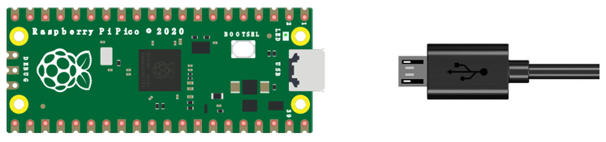
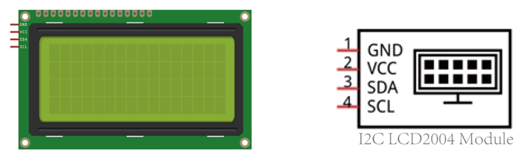
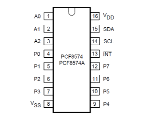
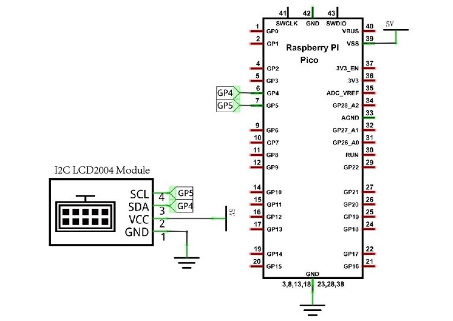
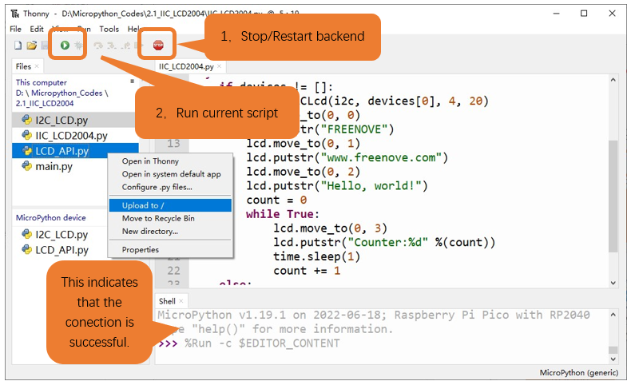
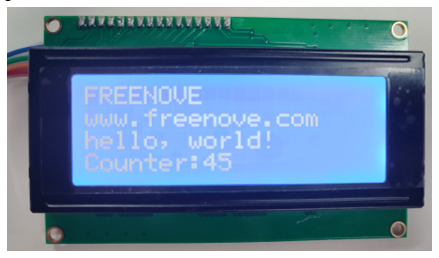
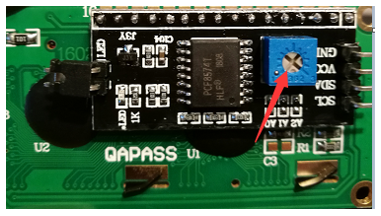

##############################################################################
Chapter 2 LCD2004
##############################################################################

In the previous chapter, we studied the LCD1602 display. In order to display more content,In this chapter, we will learn about the LCD2004 Display Screen.

Project 2.1 LCD2004
*********************************

In this section we learn how to use LCD2004 to display something.

Component knowledge 
==================================

Power
------------------------------------

In this tutorial, we connect Raspberry Pi Pico and compter with a USB cable.

I2C communication
------------------------------------

I2C (Inter-Integrated Circuit) is a two-wire serial communication mode, which can be used for the connection of micro controllers and their peripheral equipment. Devices using I2C communication must be connected to the serial data (SDA) line, and serial clock (SCL) line (called I2C bus). Each device has a unique address and can be used as a transmitter or receiver to communicate with devices connected to the bus.

LCD2004 communication
-----------------------------------

The LCD2004 display screen can display 4 lines of characters in 20 columns. It is capable of displaying numbers, letters, symbols, ASCII code and so on. As shown below is a monochrome LCD2004 display screen along with its circuit pin diagram.

.. image:: ../../_static/imgs/Raspberry_Pi_Pico/C/2_I2C_LCD2004/Chapter02_00.png
    :align: center

I2C LCD2004 display screen integrates a I2C interface, which connects the serial-input & parallel-output module to the LCD2004 display screen. This allows us to only use 4 lines to the operate the LCD2004.

The serial-to-parallel IC chip used in this module is PCF8574T (PCF8574AT), and its default I2C address is 0x27(0x3F). 

Below is the PCF8574 pin schematic diagram and the block pin diagram:

+--------------------------+----------------------------+
| PCF8574 chip pin diagram | PCF8574 module pin diagram |
|                          |                            |
| |Chapter02_02|           | |Chapter02_03|             |
+--------------------------+----------------------------+

.. |Chapter02_03| image:: ../../_static/imgs/Raspberry_Pi_Pico/C/2_I2C_LCD2004/Chapter02_03.png

PCF8574 module pin and LCD2004 pin are corresponding to each other and connected with each other:

.. image:: ../../_static/imgs/Raspberry_Pi_Pico/C/2_I2C_LCD2004/Chapter02_04.png
    :align: center

So we only need 4 pins to control the 16 pins of the LCD2004 Display Screen through the I2C interface.

In this project, we will use the I2C LCD2004 to display some static characters and dynamic variables.

Circuit
================================

+----------------------------------------------------------+
| Schematic diagram                                        |
|                                                          |
| |Chapter02_05|                                           |
+----------------------------------------------------------+
| Hardware connection. If you need any support,            |
|                                                          |
| please feel free to contact us via: support@freenove.com |
|                                                          |
| |Chapter02_06|                                           |
+----------------------------------------------------------+

.. |Chapter02_06| image:: ../../_static/imgs/Raspberry_Pi_Pico/C/2_I2C_LCD2004/Chapter02_06.png

Code
=================================

Codes used in this tutorial are saved in 

**"Freenove_LCD_Module/Freenove_LCD_Module_for_Raspberry_Pi_Pico/Python_Codes".**

You can move the codes to any location. For example, we save the codes in Disk(D) with the path of 

**"D:/Micropython_Codes".**

Open "Thonny", click "This computer" -> "D:" -> "Micropython_Codes" -> "2.1_I2C_LCD2004". Select "I2C_LCD.py"and "LCD_API.py", right click your mouse to select "Upload to /", wait for "I2C_LCD.py" and"LCD_API.py" to be uploaded to Raspberry Pi Pico and then double click "I2C_LCD2004.py". 

2.1_I2C_LCD2004
---------------------------------

Click "Run current script" and LCD2004 displays some characters.Press Ctrl+C or click "Stop/Restart backend" to exit the program.

.. note::
    
    If you cannot see anything on the display or the display is not clear, try rotating the white knob on back of LCD2004 slowly, which adjusts the contrast, until the screen can display clearly.

The following is the program code:

.. literalinclude:: ../../../../freenove_Kit/Freenove_LCD_Module_for_Raspberry_Pi_Pico/Python/Python_Codes/2.1_IIC_LCD2004/IIC_LCD2004.py
    :linenos:
    :language: python
    :dedent:

Import time, I2C and I2C_LCD modules.

.. literalinclude:: ../../../../freenove_Kit/Freenove_LCD_Module_for_Raspberry_Pi_Pico/Python/Python_Codes/2.1_IIC_LCD2004/IIC_LCD2004.py
    :linenos:
    :language: python
    :lines: 1-3
    :dedent:

Create an I2C object, initialize the I2C parameter configuration, and associate it with the LCD2004 pin. Call the scan() function to query the LCD2004 device address.

.. literalinclude:: ../../../../freenove_Kit/Freenove_LCD_Module_for_Raspberry_Pi_Pico/Python/Python_Codes/2.1_IIC_LCD2004/IIC_LCD2004.py
    :linenos:
    :language: python
    :lines: 5-6
    :dedent:

Use the if statement to determine whether the queried I2C device address is empty. If it is not empty, create an I2CLcd object and set the created I2C object, I2C device address, and the number of rows and columns of LCD2004; if it is empty, print out "No address" found" and the program exits.

.. code-block:: python
    :linenos:

    if devices != []:
        lcd = I2CLcd(i2c, devices[0], 4, 20)
        ...
    else:
        print("No address found")

Move the cursor of LCD2004 to the third row, first column, and print out "Hello, world!"

.. literalinclude:: ../../../../freenove_Kit/Freenove_LCD_Module_for_Raspberry_Pi_Pico/Python/Python_Codes/2.1_IIC_LCD2004/IIC_LCD2004.py
    :linenos:
    :language: python
    :lines: 15-16
    :dedent:

The fourth line of LCD2004 continuously prints the number of seconds after the Raspberry Pi Pico program runs.

.. literalinclude:: ../../../../freenove_Kit/Freenove_LCD_Module_for_Raspberry_Pi_Pico/Python/Python_Codes/2.1_IIC_LCD2004/IIC_LCD2004.py
    :linenos:
    :language: python
    :lines: 18-22
    :dedent:

Reference
-----------------------------------

.. py:function:: Class I2CLcd

    Before each use of the object **I2CLcd**, please make sure that **I2C_LCD.py** and **LCD_API.py** have been uploaded to "/" of Raspberry Pi Pico, and then add the statement **"from I2C_LCD import I2CLcd"** to the top of the python file. 

    **clear():** Clear the LCD2004 screen display.

    **show_cursor():** Show the cursor of LCD2004. 

    **hide_cursor():** Hide the cursor of LCD2004. 

    **blink_cursor_on():** Turn on cursor blinking.

    **blink_cursor_off():** Turn off cursor blinking. 

    **display_on():** Turn on the display function of LCD2004. 

    **display_off():** Turn on the display function of LCD2004. 

    **backlight_on():** Turn on the backlight of LCD2004.

    **backlight_off():** Turn on the backlight of LCD2004. 

    **move_to(cursor_x, cursor_y):** Move the cursor to a specified position. 

        **cursor_x:** Column cursor_x.

        **cursor_y:** Row cursor_y.

    **putchar(char):** Print the character in the bracket on LCD2004.

    **putstr(string):** Print the string in the bracket on LCD2004.
